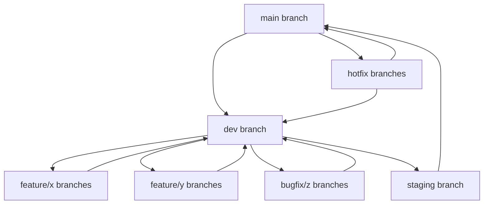

# Branching Strategy and Git Workflow

This document outlines our branch strategy and Git workflow for development and releases.

## Branch Structure

We use a modified Git Flow approach with the following branch structure:



### Branch Descriptions

- **main**: Production code, deployed to production environment
  - Always stable and deployable
  - Only merged from staging branch or hotfix branches
  - Protected branch: requires PR and approvals

- **staging**: Pre-release code for final testing
  - Deployed to staging environment
  - Integration testing and UAT happens here
  - Only merged from dev branch
  - Protected branch: requires PR and approvals

- **dev**: Development integration branch
  - Where features are integrated
  - Deployed to development environment
  - Protected branch: requires PR and approvals

- **feature/\***: Feature branches
  - Created from dev branch
  - Named as `feature/short-description`
  - Merged back to dev via PR when complete

- **bugfix/\***: Bug fix branches
  - Created from dev branch
  - Named as `bugfix/short-description`
  - Merged back to dev via PR when complete

- **hotfix/\***: Urgent fix branches
  - Created from main branch
  - Named as `hotfix/short-description`
  - Merged to main AND backported to dev
  - For critical production issues only

## Development Workflow

### Starting a New Feature

1. Create a new feature branch from dev:
   ```
   git checkout dev
   git pull origin dev
   git checkout -b feature/my-feature
   ```

2. Make changes, commit regularly:
   ```
   git add .
   git commit -m "Descriptive message"
   ```

3. Push your feature branch to remote:
   ```
   git push -u origin feature/my-feature
   ```

4. Create PR to dev branch when feature is complete
5. Address code review feedback
6. Merge to dev once approved

### Bug Fixing

1. Create a bugfix branch from dev:
   ```
   git checkout dev
   git pull origin dev
   git checkout -b bugfix/issue-description
   ```

2. Fix the bug, commit and push:
   ```
   git add .
   git commit -m "Fix: description"
   git push -u origin bugfix/issue-description
   ```

3. Create PR to dev branch
4. Address review feedback
5. Merge to dev once approved

### Hotfixes

1. Create hotfix branch from main:
   ```
   git checkout main
   git pull origin main
   git checkout -b hotfix/critical-issue
   ```

2. Fix the issue, commit and push:
   ```
   git add .
   git commit -m "Hotfix: description"
   git push -u origin hotfix/critical-issue
   ```

3. Create PR to main branch
4. Create second PR to dev branch
5. Address review feedback
6. Merge to main once approved
7. Merge to dev to ensure the fix persists in future releases

## Release Process

1. When dev branch is ready for release:
   - Create PR from dev to staging
   - Perform integration testing on staging
   - Fix any issues discovered

2. When staging is verified:
   - Create PR from staging to main
   - Deploy to production
   - Tag the release with version number:
     ```
     git checkout main
     git pull origin main
     git tag -a v1.0.0 -m "Version 1.0.0"
     git push origin v1.0.0
     ```

## Best Practices

1. **Never commit directly** to protected branches (main, staging, dev)
2. **Rebase feature branches** regularly to stay current with dev
3. **Write meaningful commit messages**
4. **Reference issue numbers** in commits and PRs
5. **Keep PRs focused** on a single feature or fix
6. **Delete branches** after merging
7. **Review your own code** before submitting for review
8. **Add tests** for new features and bug fixes