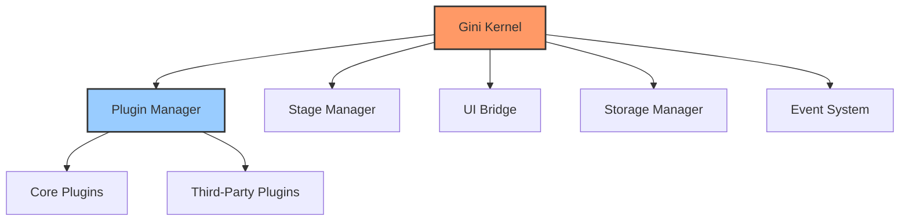

# Gini: QEMU/KVM Deployment System

A modular system for deploying macOS virtual machines using QEMU/KVM.

[](https://github.com/kunihir0/osx/actions/workflows/rust-coverage.yml)
[](https://kunihir0.github.io/osx/html)

## Overview

Gini is a modular system built on an "Everything is a Plugin" architecture that enables flexible, customizable deployment of macOS virtual machines on Linux systems using QEMU/KVM. The system is designed to be extensible, allowing for easy creation of custom plugins to modify or enhance functionality.

## Architecture



## Key Components

- **Kernel**: Core application lifecycle and component management system
- **Plugin System**: Manages loading, registration, and initialization of plugins
- **Event System**: Provides asynchronous event dispatching and handling
- **Stage Manager**: Orchestrates execution of stages in the correct order with dependency resolution
- **Storage System**: Abstract interface for working with file system
- **UI Bridge**: Minimal abstraction layer for interfacing with user interfaces

## Prerequisites

- A functional Linux system
- QEMU/KVM properly configured
- (Optional) VFIO configured for GPU passthrough
- LVM for VM storage

## Getting Started

See the [setup guide](docs/setup-guide.md) for detailed instructions on setting up your development environment.

## Documentation

- [Architecture Overview](docs/architecture.md)
- [Kernel System](docs/kernel-system.md)
- [Event System](docs/event-system.md)
- [Plugin System](docs/plugin-system.md)
- [Stage Manager](docs/stage-manager.md)
- [Storage System](docs/storage-system.md)
- [UI Bridge](docs/ui-bridge.md)

## Developer Guides

- [Development Environment Setup](docs/setup-guide.md)
- [Testing Workflow](docs/testing-guide.md)
- [Creating Plugins](docs/plugin-creation-guide.md)
- [Contributing](docs/contributing.md)
- [API Reference](docs/api-reference.md)

## Repository Structure

```
gini/                            # Project Root
├── crates/                      # Workspace members
│   ├── gini-core/               # Core library crate
│   │   └── src/
│   │       ├── event/           # Event system
│   │       ├── kernel/          # Core application kernel
│   │       ├── plugin_system/   # Plugin infrastructure
│   │       ├── stage_manager/   # Stage management system
│   │       ├── storage/         # Storage management
│   │       ├── ui_bridge/       # Minimal UI abstraction layer
│   │       └── utils/           # Core utilities
│   └── gini/                    # Binary crate
│       └── src/
│           └── main.rs          # Application entry point
├── docs/                        # Documentation
└── plugins/                     # Plugin directory
    └── examples/                # Example plugins