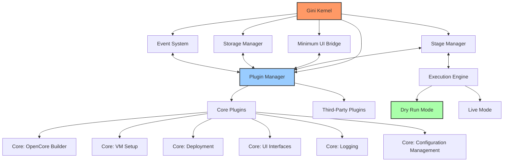
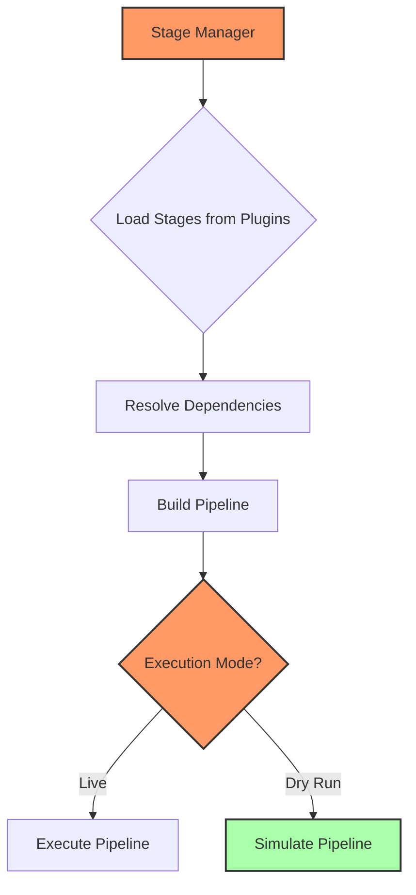

# Gini Architecture

## Overview

Gini is built on an "Everything is a Plugin" architecture, with a minimal kernel that coordinates the operation of all other components. This approach enables extreme modularity, simplified development, and resilient behavior.

## Core Architecture Design

## Component Interactions

The design uses a modular component system with well-defined interfaces:

1. **Kernel**: Central component that manages the application lifecycle and coordinates all other components
2. **Plugin Manager**: Manages plugin loading, initialization, and lifecycle
3. **Stage Manager**: Orchestrates execution of stages with dependency resolution
4. **Storage Manager**: Provides unified access to file systems and storage
5. **Event System**: Enables asynchronous communication between components
6. **UI Bridge**: Minimal abstraction layer for user interface interactions

## Key Features

### Component-Based Architecture

The system uses a component-based design where:

- Components implement the `KernelComponent` trait
- The kernel initializes components in the correct order
- Components communicate through well-defined interfaces
- Each component manages its own resources

### Dependency Injection

Components are loosely coupled through dependency injection:

- Components receive their dependencies rather than creating them
- The kernel maintains a dependency registry for shared components
- Testing is simplified by allowing mock implementations

### Asynchronous Operations

The system leverages Tokio for asynchronous processing:

- Non-blocking I/O for performance
- Task management and structured concurrency
- Graceful shutdown coordination
- Error handling in async contexts

### Plugin System

The plugin architecture allows for extreme modularity:

- Even core functionality is implemented as plugins
- Plugins are equal citizens with a consistent interface
- The system can be pared down to a minimal set of plugins
- Different plugin combinations support different use cases

### Stage System

The stage system enables flexible workflows:

## Implementation Details

The core components are implemented in the `gini-core` crate:

- `kernel`: Application lifecycle and component management
- `event`: Async event dispatching and handling
- `plugin_system`: Plugin loading and management
- `stage_manager`: Stage workflow execution
- `storage`: Storage access abstractions
- `ui_bridge`: UI communications bridge
- `utils`: Common utilities

## Execution Flow

1. The application bootstraps the kernel
2. The kernel initializes core components
3. The plugin manager loads and initializes plugins
4. The stage manager builds a pipeline based on plugin-provided stages
5. The pipeline executes stages in the correct order
6. Events are dispatched asynchronously between components as needed