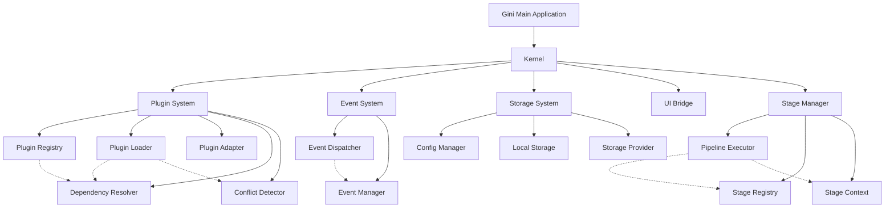
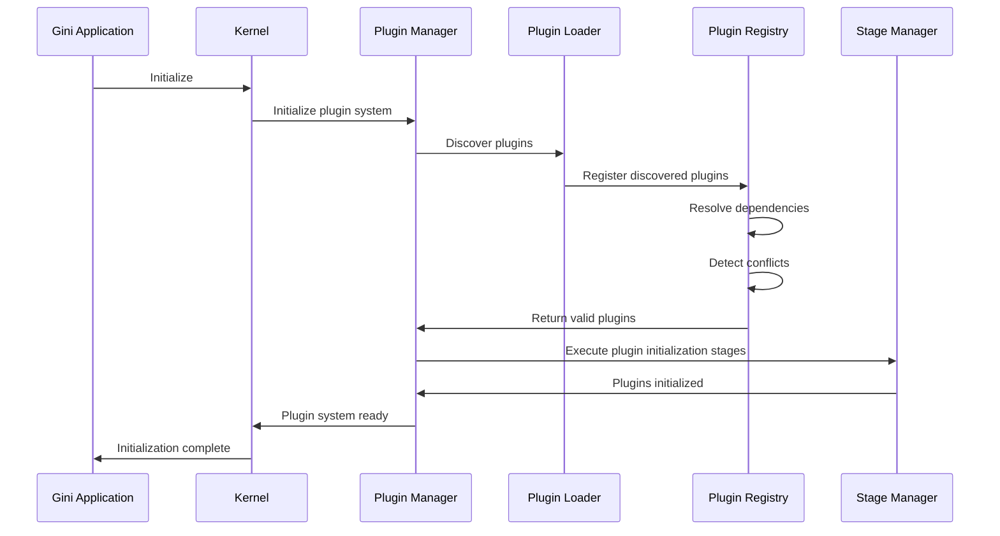
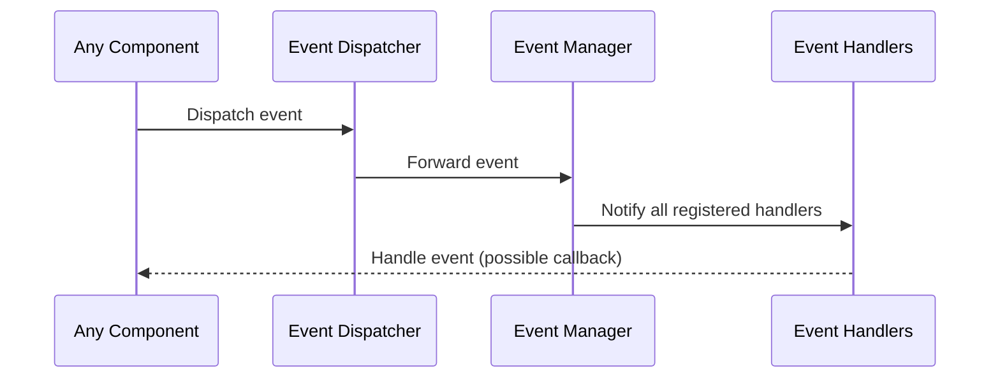

# Component Relationships

This document outlines the relationships between key components in the Gini application architecture.

## System Architecture

## Key Interaction Flows

### Plugin Lifecycle

### Event Handling

## Module Dependencies

| Module | Depends On |
|--------|------------|
| Kernel | Event System, Plugin System, Storage System, UI Bridge |
| Plugin System | Event System, Storage System |
| Stage Manager | Plugin System, Event System |
| Storage System | - |
| Event System | - |
| UI Bridge | Event System |