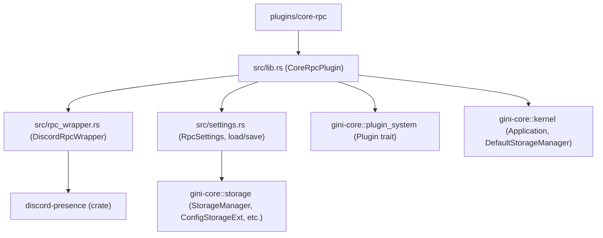

# Plan: `core-rpc` Plugin for Gini Framework

**Objective:** Create a `core-rpc` plugin that manages Discord Rich Presence (DRP) by wrapping the `discord-presence = "1.6"` library and integrating with Gini's storage system for configuration. This plugin is a statically linked core plugin and **will use the `discord-presence` crate to handle the connection and communication with the Discord client.**

## 1. Plugin Directory Structure

```
plugins/core-rpc/
├── Cargo.toml
└── src/
    ├── lib.rs          # Main plugin logic, Plugin trait implementation
    ├── rpc_wrapper.rs  # Discord Rich Presence logic wrapper
    └── settings.rs       # Configuration loading and saving
```

## 2. `plugins/core-rpc/Cargo.toml`

```toml
[package]
name = "core-rpc"
version = "0.1.0"
edition = "2021"

# For a statically linked core plugin, "cdylib" is likely not needed.
# Consider changing to "lib" or "rlib" in a future review.
# For now, keep as is to avoid introducing unrelated changes.
[lib]
crate-type = ["rlib"] # Changed to "rlib" for a statically linked core plugin

[dependencies]
gini-core = { path = "../../crates/gini-core" } # Adjust path as necessary
discord-presence = "1.6"
serde = { version = "1.0", features = ["derive"] }
toml = "0.8"
tokio = { version = "1", features = ["full"] } # For async tasks in rpc_wrapper
log = "0.4"
async-trait = "0.1.77" # Or latest compatible
thiserror = "1.0" # For custom error types
chrono = { version = "0.4", features = ["serde"] } # For timestamps if needed in DRP

[dev-dependencies]
# Add testing dependencies if needed, e.g., mockall
```

**Note:** Changed `crate-type` to `["rlib"]` as appropriate for a statically linked library.

## 3. `plugins/core-rpc/src/settings.rs`

This file will handle loading and saving `RpcSettings` from/to `core-rpc.toml`.

**Key Logic:**
*   Define `RpcSettings` struct (with `client_id`, `enabled`, `default_details`, `default_state`).
*   Implement `Default` for `RpcSettings`.
*   Implement `load_settings` (async):
    *   Takes `storage_manager: &(impl StorageManager + ConfigStorageExt)`.
    *   Uses `storage_manager.config_manager()`.
    *   Uses `StorageScope::Plugin { plugin_name: "core-rpc", config_scope: PluginConfigScope::User }` and `PluginConfigScope::Default`.
    *   Reads `core-rpc.toml` using `config_manager.read_config_file(scope, CORE_RPC_CONFIG_FILENAME).await`. (Pass `CORE_RPC_CONFIG_FILENAME` as `&str`).
    *   Parses TOML content: `toml::from_str::<RpcSettings>(&content_string)`.
    *   Handles fallbacks: User -> Default -> `RpcSettings::default()`.
    *   Attempts to save `RpcSettings::default()` to user scope if no config files are found.
*   Implement `save_settings` (async):
    *   Takes `storage_manager: &(impl StorageManager + ConfigStorageExt), settings: &RpcSettings`.
    *   Serializes `settings` to TOML string: `toml::to_string_pretty(settings)`.
    *   Writes to user scope: `config_manager.write_config_file(user_scope, CORE_RPC_CONFIG_FILENAME, &content).await`. (Pass `CORE_RPC_CONFIG_FILENAME` as `&str`).
*   Define `SettingsError` enum (wrapping `StorageSystemError`, `toml::de::Error`, `toml::ser::Error`, `std::io::Error`). Implement `Display` and `std::error::Error`.
*   Ensure correct imports:
    ```rust
    use gini_core::storage::manager::StorageManager;
    use gini_core::storage::config::{ConfigStorageExt, StorageScope};
    use gini_core::storage::PluginConfigScope;
    use gini_core::storage::error::StorageSystemError;
    use serde::{Deserialize, Serialize};
    use log::{debug, error, info, warn};
    use std::path::Path; // If ConfigManager methods expect AsRef<Path>
    ```

## 4. `plugins/core-rpc/src/rpc_wrapper.rs`

This file encapsulates interactions with the `discord-presence` crate.

**Key Logic:**
*   Define `DiscordRpcWrapper` struct:
    *   `client: Option<discord_presence::Client>` (or the correct type for the client object from the `discord-presence` crate).
    *   `client_id: String`
    *   `current_presence_data: Arc<Mutex<Option<InternalRichPresenceData>>>` (where `InternalRichPresenceData` is a local struct holding details, state, timestamps, assets, party, buttons).
    *   `command_sender: Option<tokio::sync::mpsc::Sender<RpcCommand>>`
    *   `rpc_task_handle: Option<tokio::task::JoinHandle<Result<(), WrapperError>>>`
*   Define `InternalRichPresenceData` struct to store all presence fields. Implement `PartialEq` for it.
*   Define `RpcCommand` enum (e.g., `UpdatePresence(InternalRichPresenceData)`, `ClearPresence`, `Shutdown`).
*   Define `WrapperError` enum (wrapping `discord_presence::Error` (once resolved), `tokio::sync::mpsc::error::SendError`, internal errors). Implement `Display` and `std::error::Error`.
*   Implement methods:
    *   `new(client_id: String) -> Self`
    *   `start(&mut self) -> Result<(), WrapperError>`:
        *   Creates `discord_presence::Client` with `client_id`.
        *   Spawns an async Tokio task (`Self::rpc_event_loop`).
        *   This task (`rpc_event_loop`) will be responsible for:
            1.  Attempting to connect to Discord using `client.connect()` (or equivalent).
            2.  Entering a loop that:
                *   Processes commands received via an MPSC channel (e.g., `UpdatePresence`, `ClearPresence`, `Shutdown`).
                *   Calls `client.poll_event()` (or equivalent) to handle Discord RPC events (e.g., `Ready`, `Error`, `Disconnected`). Log these events.
                *   If `RpcCommand::UpdatePresence` is received, it calls `client.set_activity(...)` with the provided data (after converting local `InternalRichPresenceData` to `discord_presence::RichPresence`).
                *   If `RpcCommand::ClearPresence` is received, it calls `client.clear_activity()`.
                *   If `RpcCommand::Shutdown` is received, it calls `client.close()` (or equivalent) and exits the loop.
            3.  Handles connection errors and potential reconnection logic (basic logging for now).
        *   Stores `command_sender` (for sending commands to the loop) and `rpc_task_handle` (for the spawned task).
    *   `shutdown(&mut self) -> Result<(), WrapperError>`:
        *   Sends `RpcCommand::Shutdown` via `command_sender` to the `rpc_event_loop`.
        *   Does *not* directly await the `rpc_task_handle` here; the task is expected to terminate upon receiving the shutdown command.
        *   The `rpc_task_handle` will be taken and dropped by the `CoreRpcPlugin` in `lib.rs`.
    *   `take_task_handle(&mut self) -> Option<tokio::task::JoinHandle<Result<(), WrapperError>>>`: Returns and clears `self.rpc_task_handle`.
    *   Methods to set/update presence (e.g., `set_activity(details: Option<String>, state: Option<String>, ...)`):
        *   Construct `InternalRichPresenceData`.
        *   Lock `self.current_presence_data`, compare with new data.
        *   If different, update `self.current_presence_data` and send `RpcCommand::UpdatePresence` to the async task.
    *   `update_game_status(&mut self, app_name: &str, current_task: &str) -> Result<(), WrapperError>`: An example abstraction.
    *   `clear_presence(&mut self) -> Result<(), WrapperError>`: Sends `RpcCommand::ClearPresence`.
*   **Unresolved Issue:** The exact import paths for `discord_presence::Error`, `discord_presence::RichPresence`, `discord_presence::Button`, and `discord_presence::Client` are still problematic. This needs to be resolved by consulting the `discord-presence v1.6.0` documentation or its source code.

## 5. `plugins/core-rpc/src/lib.rs`

This is the main plugin file, implementing the `Plugin` trait.

**Key Logic:**
*   **No `gini_plugin!` macro call.** The plugin is assumed to be registered programmatically by `gini-core` or the main `gini` application as it's a "core plugin".
*   Define `CoreRpcPlugin` struct:
    *   `settings: Arc<Mutex<RpcSettings>>`
    *   `wrapper_state: Arc<Mutex<(Option<DiscordRpcWrapper>, Option<JoinHandle<Result<(), WrapperError>>>)>>` (Tuple to hold wrapper and its task handle)
*   Implement `Plugin` trait for `CoreRpcPlugin`:
    *   Standard methods: `name()`, `version()`, `is_core()` (returns `true`), `priority()`, `compatible_api_versions()`, `dependencies()`, `conflicts_with()`, `incompatible_with()`, `required_stages()`.
    *   `init(&self, app: &mut Application) -> Result<(), PluginSystemError>`:
        *   Access `StorageManager` using `app.get_component::<DefaultStorageManager>()`. This call is assumed to be `async`.
        *   The entire async operation (getting component and loading settings) is wrapped in `tokio::runtime::Handle::current().block_on(...)`.
        *   Inside the `async` block:
            *   `let storage_manager_arc = app.get_component::<DefaultStorageManager>().await.ok_or(CoreRpcError::StorageManagerUnavailable)?;`
            *   `load_settings(storage_manager_arc.as_ref()).await.map_err(CoreRpcError::from)?` (or `map_err(CoreRpcError::Settings)`).
        *   The result of `block_on` (which is `Result<RpcSettings, CoreRpcError>`) is then mapped to `PluginSystemError`: `let loaded_settings = settings_result.map_err(PluginSystemError::from)?;`.
        *   Store loaded settings in `self.settings`.
        *   If `settings.enabled` and `client_id` is present:
            *   Create `DiscordRpcWrapper`.
            *   Call `wrapper.start()`.
            *   Call `wrapper.take_task_handle()` and store the handle and wrapper instance in `self.wrapper_state.lock().unwrap()`.
    *   `shutdown(&self) -> Result<(), PluginSystemError>`:
        *   Lock `self.wrapper_state`.
        *   Correctly take the `Option<DiscordRpcWrapper>` and `Option<JoinHandle>` from the tuple: `let (taken_wrapper_opt, taken_handle_opt) = (state_guard.0.take(), state_guard.1.take());`.
        *   If wrapper exists (`taken_wrapper_opt.is_some()`), call `wrapper_instance.shutdown()` (which signals its internal task).
        *   The `taken_handle_opt` is dropped, detaching the task.
    *   `register_stages(&self, _registry: &mut StageRegistry) -> Result<(), PluginSystemError>`: Return `Ok(())`.
    *   `async fn preflight_check(&self, _context: &StageContext) -> Result<(), PluginSystemError>`: Return `Ok(())`.
*   Define `CoreRpcError` enum (wrapping `WrapperError`, `SettingsError`, `Lifecycle`, `StorageManagerUnavailable`, `TokioRuntimeError`). Implement `Display`, `std::error::Error`, and `From<SettingsError>`, `From<WrapperError>`.
*   Implement `From<CoreRpcError> for PluginSystemError`.
*   Ensure correct imports: `Application`, `DefaultStorageManager`, `StorageManager`, `KernelComponent` (if needed for `get_component` type bounds, though `DefaultStorageManager` should implement it).

## 6. Error Handling Summary

*   **`rpc_wrapper.rs` -> `WrapperError`**: For `discord-presence` issues, MPSC send errors, internal logic.
*   **`settings.rs` -> `SettingsError`**: For TOML (de)serialization, `StorageSystemError`, `std::io::Error`.
*   **`lib.rs` -> `CoreRpcError`**: Aggregates `WrapperError`, `SettingsError`. Adds `Lifecycle` for plugin-specific operational errors (e.g., failing to get task handle), `StorageManagerUnavailable`, `TokioRuntimeError`.
*   **`lib.rs` -> `PluginSystemError`**: `CoreRpcError` converts into `PluginSystemError::InitializationError` for integration with Gini.

## 7. Key Unresolved Issues & Next Steps for Implementation Phase

1.  **`discord-presence` Imports (`rpc_wrapper.rs`):**
    *   **Highest Priority:** This blocks `rpc_wrapper.rs` compilation. Needs definitive paths for `Client`, `Error`, `RichPresence`, `Button` from `discord-presence v1.6.0`.
    *   **Action:** Consult crate documentation (e.g., on docs.rs) or source code.
2.  **`Application::get_component` Behavior:**
    *   **Confirm:** Is `app.get_component::<DefaultStorageManager>()` async? Does it return `Option<Arc<DefaultStorageManager>>`? The `core-logging` example used `get_kernel_component` (potentially different) and seemed synchronous. `cargo check` errors for `core-rpc` are the best guide here.
    *   **Action:** Proceed with the `async` assumption and `DefaultStorageManager` based on `cargo check` output.
3.  **Static Plugin Registration in Gini:**
    *   **Clarify:** How are core plugins like `core-logging` and `core-rpc` (now that `gini_plugin!` is removed) actually instantiated and registered with the `PluginManager`? This is external to `core-rpc` but vital for its operation and testing.
    *   **Action:** This might require looking at `crates/gini/src/main.rs` or `Application` bootstrap code in `gini-core`.

## 8. Mermaid Diagrams

### 8.1. Plugin Module Structure



### 8.2. `CoreRpcPlugin::init()` High-Level Flow (Revised)

```mermaid
sequenceDiagram
    participant App as Application
    participant CoreRpcPlugin
    participant TokioRuntime as Tokio Runtime
    participant StorageAPI as gini-core::storage
    participant RpcSettingsMod as core-rpc::settings
    participant RpcWrapperMod as core-rpc::rpc_wrapper

    CoreRpcPlugin->>TokioRuntime: block_on (async block for settings)
    activate TokioRuntime
        TokioRuntime->>App: get_component::<DefaultStorageManager>()
        App-->>TokioRuntime: Future<Option<Arc<DefaultStorageManager>>>
        TokioRuntime->>TokioRuntime: await component_future
        TokioRuntime-->>StorageAPI: Arc<DefaultStorageManager> (as storage_manager_arc)
        TokioRuntime->>RpcSettingsMod: load_settings(storage_manager_arc.as_ref())
        activate RpcSettingsMod
            RpcSettingsMod->>StorageAPI: read_config_file (user)
            StorageAPI-->>RpcSettingsMod: User settings / None / Error
            alt User settings not found/invalid
                RpcSettingsMod->>StorageAPI: read_config_file (default)
                StorageAPI-->>RpcSettingsMod: Default settings / None / Error
            end
            alt No files found or parse error
                 RpcSettingsMod->>RpcSettingsMod: RpcSettings::default()
                 RpcSettingsMod->>StorageAPI: save_settings (for default)
                 StorageAPI-->>RpcSettingsMod: Save Result
            end
        RpcSettingsMod-->>TokioRuntime: Result<RpcSettings, SettingsError>
        deactivate RpcSettingsMod
        TokioRuntime->>TokioRuntime: Map SettingsError to CoreRpcError
    TokioRuntime-->>CoreRpcPlugin: Result<RpcSettings, CoreRpcError>
    deactivate TokioRuntime
    CoreRpcPlugin->>CoreRpcPlugin: Map CoreRpcError to PluginSystemError

    CoreRpcPlugin->>CoreRpcPlugin: Store RpcSettings
    alt Settings enabled & Client ID present
        CoreRpcPlugin->>RpcWrapperMod: DiscordRpcWrapper::new()
        CoreRpcPlugin->>RpcWrapperMod: wrapper.start()
        activate RpcWrapperMod
            RpcWrapperMod->>RpcWrapperMod: Spawns async DRP task (handles connect, poll, etc.)
        RpcWrapperMod-->>CoreRpcPlugin: Result<(), WrapperError>
        deactivate RpcWrapperMod
        CoreRpcPlugin->>RpcWrapperMod: wrapper.take_task_handle()
        RpcWrapperMod-->>CoreRpcPlugin: Option<JoinHandle>
        CoreRpcPlugin->>CoreRpcPlugin: Store wrapper & handle in wrapper_state
    end