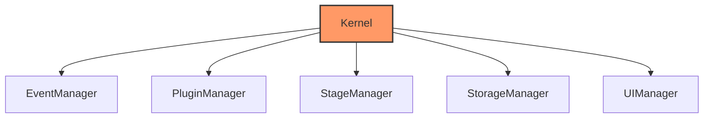

# Kernel System

## Overview

The kernel is the core of the Gini application that provides application lifecycle management and component coordination. It serves as the foundation upon which other modules are built, managing the initialization, startup, and shutdown of all components.

## Component-Based Architecture



The kernel uses a component-based architecture where each major subsystem is implemented as a `KernelComponent`:

```rust
#[async_trait]
pub trait KernelComponent: Send + Sync {
    /// Get the name of the component
    fn name(&self) -> &'static str;
    
    /// Initialize the component
    async fn initialize(&self) -> Result<()>;
    
    /// Start the component
    async fn start(&self) -> Result<()>;
    
    /// Stop the component
    async fn stop(&self) -> Result<()>;
}
```

## Dependency Registry

Components can access other components through the dependency registry:

```rust
pub struct DependencyRegistry {
    components: HashMap<TypeId, Box<dyn Any + Send + Sync>>,
}

impl DependencyRegistry {
    pub fn register<T: 'static + Send + Sync>(&mut self, component: T) {
        self.components.insert(TypeId::of::<T>(), Box::new(component));
    }
    
    pub fn get<T: 'static>(&self) -> Option<&T> {
        self.components.get(&TypeId::of::<T>())
            .and_then(|boxed| boxed.downcast_ref::<T>())
    }
}
```

## Application Structure

The `Application` struct in `kernel/bootstrap.rs` is the main entry point:

```rust
pub struct Application {
    base_path: PathBuf,
    user_path: PathBuf,
    registry: DependencyRegistry,
    event_dispatcher: Option<EventDispatcher>,
    plugin_manager: Option<Box<dyn PluginManager>>,
    stage_manager: Option<Box<dyn StageManager>>,
    storage_manager: Option<Box<dyn StorageManager>>,
    ui_manager: Option<Box<dyn UIManager>>,
}
```

It provides:
- Initialization with a base path (defaults to current directory)
- User data directory setup
- Async `run()` method to initialize components
- Component registration and access

## Lifecycle Management

The kernel manages the application lifecycle in several phases:

1. **Bootstrap**: Create the Application instance and set up paths
2. **Registration**: Register all components with the dependency registry
3. **Initialization**: Initialize all components in dependency order
4. **Startup**: Start all components, enabling them to begin their work
5. **Execution**: Run the main application logic
6. **Shutdown**: Stop all components in reverse order from startup

```rust
impl Application {
    pub async fn run(&mut self) -> Result<()> {
        // Initialize components
        self.initialize_components().await?;
        
        // Start components
        self.start_components().await?;
        
        // Main execution
        self.execute().await?;
        
        // Shutdown
        self.shutdown().await?;
        
        Ok(())
    }
}
```

## Error Handling

The kernel provides centralized error handling through the `Error` enum:

```rust
#[derive(Debug)]
pub enum Error {
    Init(String),
    Plugin(String),
    Stage(String),
    Storage(String),
    Event(String),
    UI(String),
    IO(String),
    Other(String),
}
```

This is being migrated to a more component-specific error model using `thiserror` for better context:

```rust
#[derive(Debug, thiserror::Error)]
pub enum KernelError {
    #[error("Failed to initialize component {name}: {reason}")]
    InitFailure { name: String, reason: String },
    
    #[error("Component not found: {0}")]
    ComponentNotFound(String),
    
    // Other variants
}
```

## Asynchronous Processing

The kernel uses Tokio for asynchronous operations:

- The application entry point uses `#[tokio::main]`
- Component interfaces use `async` functions
- Event handling is asynchronous
- Components can spawn tasks using the runtime handle
- Structured cancellation is supported for clean shutdown

## Component Interactions

The kernel coordinates several major subsystems:

1. **Event System**: Manages application events through an event dispatcher
2. **Plugin System**: Handles plugin loading and registration
3. **Stage Manager**: Executes stages in a pipeline with dependency resolution
4. **Storage Management**: Provides file system access abstraction
5. **UI Bridge**: Interface between core logic and user interface