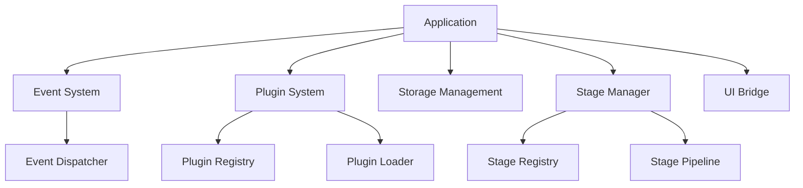
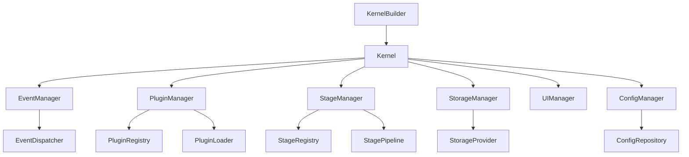

# Kernel Architecture Design Document

## Table of Contents

1. [Current Architecture Overview](#current-architecture-overview)
2. [Identified Issues and Improvement Opportunities](#identified-issues-and-improvement-opportunities)
3. [Proposed Architecture](#proposed-architecture)
4. [Asynchronous Processing with Tokio](#asynchronous-processing-with-tokio)
5. [Module Organization and Decoupling](#module-organization-and-decoupling)
6. [Migration Path](#migration-path)
7. [Priority Recommendations](#priority-recommendations)

## Current Architecture Overview

The kernel module currently serves as the core orchestration layer for the OSX-Forge application. It provides application lifecycle management and serves as the foundation upon which other modules are built.

### Main Components



### Current Implementation Analysis

#### Application Structure

The `Application` struct in `kernel/bootstrap.rs` is the main entry point for the application. It currently:

- Initializes with a base path (default to current directory)
- Sets up the user data directory
- Provides async `run()` method to initialize components
- Uses minimal error handling via the `Error` enum

#### Error Handling

The current error model is centralized in `kernel/error.rs` and provides:

- A custom `Error` enum with variants for different types of errors
- Basic conversion from standard library errors
- A `Result<T>` type alias

#### Asynchronous Architecture

The application is built with asynchronous processing in mind:

- Uses `#[tokio::main]` in the main entry point
- Has async functions in the `Application` implementation
- Various component interfaces (e.g., `Stage`, `AsyncEventHandler`) use async traits

#### Component Interactions

The kernel coordinates several major subsystems:

1. **Event System**: Manages application events through an event dispatcher
2. **Plugin System**: Handles plugin loading and registration
3. **Stage Manager**: Executes stages in a pipeline with dependency resolution
4. **Storage Management**: Provides file system access abstraction
5. **UI Bridge**: Interface between core logic and user interface (not fully implemented)

## Identified Issues and Improvement Opportunities

From analyzing the current implementation, several areas for improvement have been identified:

### 1. Tight Coupling Between Components

The `Application` struct directly manages and coordinates all major subsystems, creating tight coupling. This makes it difficult to:

- Test components in isolation
- Replace or upgrade individual components
- Maintain clean separation of concerns

### 2. Inconsistent Asynchronous Patterns

While the code uses `async/await`, there are inconsistencies in how asynchronous operations are managed:

- Some operations use blocking calls inside async functions
- Error propagation in asynchronous contexts is inconsistent
- No clear strategy for cancellation or timeouts

### 3. Centralized Error Handling

The `Error` enum is used across all components, which:

- Creates coupling between error handling and specific domains
- Makes it difficult to provide detailed error context
- Doesn't leverage Rust's type system for more refined error handling

### 4. Limited Resource Management

The current architecture lacks:

- Clear lifecycle management for resources
- Proper shutdown and cleanup procedures
- Resource limit controls

### 5. Testing Challenges

The current architecture has testability issues:

- Tests require setting up the entire application
- Mocking dependencies is difficult
- High integration test setup cost

## Proposed Architecture

The proposed architecture aims to address the identified issues while maintaining compatibility with the existing codebase.

### Key Architectural Principles

1. **Dependency Injection**: Components should receive their dependencies rather than creating them
2. **Interface-Based Design**: Components should interact through well-defined interfaces
3. **Asynchronous by Default**: All I/O operations should be asynchronous
4. **Resource Isolation**: Each component should manage its own resources
5. **Error Contextualization**: Errors should capture context and provide clear failure information

### Core Components



### Kernel Structure

```rust
// The main kernel interface that provides access to all subsystems
pub struct Kernel {
    // Configuration
    config: ConfigManager,
    // Event system
    event_manager: EventManager,
    // Plugin system
    plugin_manager: PluginManager,
    // Stage management
    stage_manager: StageManager,
    // Storage management
    storage_manager: StorageManager,
    // UI bridge
    ui_manager: UIManager,
    // Shutdown signal
    shutdown: Arc<AtomicBool>,
}
```

### Builder Pattern for Kernel Construction

```rust
// Builder for creating a kernel with custom components
pub struct KernelBuilder {
    config: Option<ConfigManager>,
    event_manager: Option<EventManager>,
    // Other optional components
}

impl KernelBuilder {
    // Default constructor
    pub fn new() -> Self {
        Self {
            config: None,
            event_manager: None,
            // Other fields initialized to None
        }
    }
    
    // Set custom event manager
    pub fn with_event_manager(mut self, manager: EventManager) -> Self {
        self.event_manager = Some(manager);
        self
    }
    
    // Build the kernel
    pub async fn build(self) -> Result<Kernel> {
        // Initialize components with defaults or provided instances
        let config = self.config.unwrap_or_else(ConfigManager::new);
        let event_manager = self.event_manager.unwrap_or_else(EventManager::new);
        // Initialize other components
        
        Ok(Kernel {
            config,
            event_manager,
            // Other fields
            shutdown: Arc::new(AtomicBool::new(false)),
        })
    }
}
```

## Asynchronous Processing with Tokio

The kernel should leverage Tokio's capabilities more effectively to provide robust asynchronous processing.

### Runtime Management

```rust
pub struct Kernel {
    // Other fields
    
    // Runtime handle for managing tasks
    runtime_handle: Handle,
}

impl Kernel {
    // Initialize with a runtime handle
    pub fn with_runtime_handle(handle: Handle) -> Self {
        // Construction with the provided handle
    }
    
    // Get the current runtime handle
    pub fn runtime_handle(&self) -> &Handle {
        &self.runtime_handle
    }
}
```

### Task Management

Best practices for task spawning and management:

1. **Structured Concurrency**: Group related tasks together for easier management and cancellation
2. **Resource Control**: Use separate task groups with different priorities
3. **Error Propagation**: Properly handle and propagate errors from spawned tasks
4. **Cancellation Handling**: Support clean cancellation through shutdown signals

```rust
impl Kernel {
    // Spawn a task with the kernel's runtime
    pub fn spawn<F>(&self, future: F) -> tokio::task::JoinHandle<F::Output>
    where
        F: Future + Send + 'static,
        F::Output: Send + 'static,
    {
        self.runtime_handle.spawn(future)
    }

    // Spawn a critical task that should be monitored
    pub fn spawn_critical<F>(&self, future: F) -> tokio::task::JoinHandle<F::Output>
    where
        F: Future + Send + 'static,
        F::Output: Send + 'static,
    {
        let handle = self.spawn(future);
        
        // Monitor the task for completion or errors
        self.spawn(async move {
            match handle.await {
                Ok(_) => (),
                Err(e) => {
                    // Log the error or take recovery action
                    eprintln!("Critical task failed: {}", e);
                }
            }
        });
        
        handle
    }
}
```

### Shutdown Coordination

Implement a clean shutdown process that:

1. Signals all tasks to shut down
2. Waits for critical tasks to complete
3. Cancels remaining tasks if they exceed a timeout
4. Releases resources in an orderly manner

```rust
impl Kernel {
    // Initiate a graceful shutdown
    pub async fn shutdown(&self) -> Result<()> {
        // Set the shutdown signal
        self.shutdown.store(true, Ordering::SeqCst);
        
        // Notify all components
        self.event_manager.shutdown().await?;
        self.plugin_manager.shutdown().await?;
        // Other component shutdowns
        
        Ok(())
    }
}
```

## Module Organization and Decoupling

### Component Interface Pattern

Each core subsystem should follow this pattern:

1. **Manager Interface**: High-level interface for kernel interaction
2. **Implementation**: Concrete implementation of the manager interface
3. **Service Traits**: Lower-level interfaces provided by the subsystem
4. **Error Types**: Subsystem-specific error types

Example for the Event System:

```rust
// The main interface used by the kernel
pub trait EventManager: Send + Sync {
    // Register a handler for an event
    async fn register_handler(&self, ...) -> EventResult<HandlerId>;
    
    // Dispatch an event
    async fn dispatch(&self, event: &dyn Event) -> EventResult<()>;
    
    // Shutdown the event system
    async fn shutdown(&self) -> EventResult<()>;
}

// Concrete implementation
pub struct DefaultEventManager {
    dispatcher: Arc<Mutex<EventDispatcher>>,
    // Other fields
}

impl EventManager for DefaultEventManager {
    // Implementation of the interface
}

// Lower-level service trait
pub trait EventDispatcher: Send + Sync {
    // Dispatch method
}

// Error types
pub type EventResult<T> = std::result::Result<T, EventError>;

#[derive(Debug, thiserror::Error)]
pub enum EventError {
    // Error variants specific to event system
}
```

### Dependency Injection

Components should receive their dependencies through:

1. Constructor parameters
2. Builder patterns
3. Configuration structs

This approach makes testing easier by allowing mock implementations.

## Migration Path

The migration from the current architecture to the proposed one should be incremental:

### Phase 1: Interface Extraction

1. Define interfaces for each subsystem
2. Wrap existing implementations with adapter classes
3. Update the Application class to use interfaces

### Phase 2: Component Refactoring

1. Refactor each component to implement the new interfaces
2. Improve error handling with component-specific errors
3. Ensure proper resource management

### Phase 3: Kernel Implementation

1. Implement the KernelBuilder pattern
2. Migrate Application functionality to the Kernel
3. Add robust lifecycle management

### Phase 4: Asynchronous Improvements

1. Implement proper task management
2. Add structured concurrency patterns
3. Improve error propagation in async contexts

## Priority Recommendations

Based on the analysis of the current codebase, here are three immediate high-priority improvements:

### 1. Implement Interface-Based Component Architecture

**Rationale**: The current tight coupling between the `Application` and its components makes testing and maintenance difficult.

**Implementation**:
1. Extract interfaces for each major subsystem
2. Update the `Application` to use these interfaces
3. Create adapters for the existing implementations

**Example**:
```rust
// Define the event manager interface
pub trait EventManager: Send + Sync {
    fn dispatcher(&self) -> &dyn EventDispatcher;
    // Other methods
}

// Implement it for the current EventDispatcher
pub struct DefaultEventManager {
    dispatcher: SharedEventDispatcher,
}

impl EventManager for DefaultEventManager {
    fn dispatcher(&self) -> &dyn EventDispatcher {
        &self.dispatcher
    }
    // Other method implementations
}
```

### 2. Improve Asynchronous Resource Management

**Rationale**: The current implementation lacks robust resource lifecycle management, particularly for asynchronous resources.

**Implementation**:
1. Implement proper shutdown mechanism for all subsystems
2. Add structured concurrency with tokio::task::JoinSet
3. Properly propagate cancellation signals

**Example**:
```rust
impl Application {
    pub async fn shutdown(mut self) -> Result<()> {
        // Signal all components to shut down
        // Example: event_dispatcher
        if let Some(dispatcher) = self.event_dispatcher.take() {
            dispatcher.shutdown().await?;
        }
        
        // Other components
        
        Ok(())
    }
}
```

### 3. Enhance Error Handling

**Rationale**: The current error handling is too centralized and doesn't provide enough context.

**Implementation**:
1. Create component-specific error types
2. Use `thiserror` for better error definitions
3. Implement `From` traits for error conversion
4. Add context to errors

**Example**:
```rust
// In plugin_system/error.rs
use thiserror::Error;

#[derive(Debug, Error)]
pub enum PluginError {
    #[error("Failed to load plugin {id}: {reason}")]
    LoadFailure { id: String, reason: String },
    
    #[error("Plugin {id} is incompatible with API version {version}")]
    IncompatibleVersion { id: String, version: String },
    
    // Other variants
}

pub type PluginResult<T> = std::result::Result<T, PluginError>;

// Then implement From<PluginError> for kernel::Error
```

These three improvements would significantly enhance the maintainability, testability, and robustness of the kernel without requiring a complete rewrite.