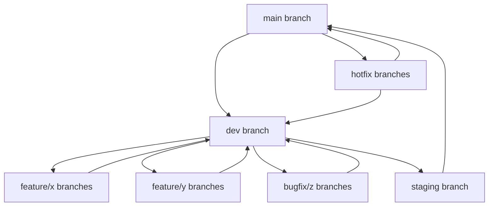

# Contributing to Gini

## Overview

Thank you for considering contributing to Gini! This document provides guidelines and instructions for contributing to the project.

## Ways to Contribute

There are many ways to contribute to Gini:

- Reporting bugs or issues
- Suggesting new features
- Improving documentation
- Writing code
- Writing tests
- Reviewing pull requests

## Branching Strategy and Git Workflow

We use a modified Git Flow approach with the following branch structure:



### Branch Descriptions

- **main**: Production code, deployed to production environment
  - Always stable and deployable
  - Only merged from staging branch or hotfix branches
  - Protected branch: requires PR and approvals

- **staging**: Pre-release code for final testing
  - Deployed to staging environment
  - Integration testing and UAT happens here
  - Only merged from dev branch
  - Protected branch: requires PR and approvals

- **dev**: Development integration branch
  - Where features are integrated
  - Deployed to development environment
  - Protected branch: requires PR and approvals

- **feature/\***: Feature branches
  - Created from dev branch
  - Named as `feature/short-description`
  - Merged back to dev via PR when complete

- **bugfix/\***: Bug fix branches
  - Created from dev branch
  - Named as `bugfix/short-description`
  - Merged back to dev via PR when complete

- **hotfix/\***: Urgent fix branches
  - Created from main branch
  - Named as `hotfix/short-description`
  - Merged to main AND backported to dev
  - For critical production issues only

## Development Workflow

### Setting Up the Development Environment

1. Fork the repository
2. Clone your fork:
   ```bash
   git clone https://github.com/your-username/gini.git
   cd gini
   ```
3. Add the upstream repository as a remote:
   ```bash
   git remote add upstream https://github.com/original-org/gini.git
   ```
4. Install development dependencies according to the [Setup Guide](setup-guide.md)

### Starting a New Feature

1. Create a new feature branch from dev:
   ```bash
   git checkout dev
   git pull origin dev
   git checkout -b feature/my-feature
   ```

2. Make changes, commit regularly:
   ```bash
   git add .
   git commit -m "Descriptive message"
   ```

3. Push your feature branch to remote:
   ```bash
   git push -u origin feature/my-feature
   ```

4. Create PR to dev branch when feature is complete
5. Address code review feedback
6. Merge to dev once approved

### Bug Fixing

1. Create a bugfix branch from dev:
   ```bash
   git checkout dev
   git pull origin dev
   git checkout -b bugfix/issue-description
   ```

2. Fix the bug, commit and push:
   ```bash
   git add .
   git commit -m "Fix: description"
   git push -u origin bugfix/issue-description
   ```

3. Create PR to dev branch
4. Address review feedback
5. Merge to dev once approved

### Hotfixes

1. Create hotfix branch from main:
   ```bash
   git checkout main
   git pull origin main
   git checkout -b hotfix/critical-issue
   ```

2. Fix the issue, commit and push:
   ```bash
   git add .
   git commit -m "Hotfix: description"
   git push -u origin hotfix/critical-issue
   ```

3. Create PR to main branch
4. Create second PR to dev branch
5. Address review feedback
6. Merge to main once approved
7. Merge to dev to ensure the fix persists in future releases

### Release Process

1. When dev branch is ready for release:
   - Create PR from dev to staging
   - Perform integration testing on staging
   - Fix any issues discovered

2. When staging is verified:
   - Create PR from staging to main
   - Deploy to production
   - Tag the release with version number:
     ```bash
     git checkout main
     git pull origin main
     git tag -a v1.0.0 -m "Version 1.0.0"
     git push origin v1.0.0
     ```

### Git Best Practices

1. **Never commit directly** to protected branches (main, staging, dev)
2. **Rebase feature branches** regularly to stay current with dev
3. **Write meaningful commit messages**
4. **Reference issue numbers** in commits and PRs
5. **Keep PRs focused** on a single feature or fix
6. **Delete branches** after merging
7. **Review your own code** before submitting for review
8. **Add tests** for new features and bug fixes

## Submitting a Pull Request

When submitting a pull request:

1. In the pull request description:
   - Describe what the changes do
   - Link to any relevant issues
   - Include screenshots or examples if applicable

2. Follow the PR template provided

## Issue Reporting

### Bug Reports

When reporting a bug, please include:

- A clear, descriptive title
- Steps to reproduce the issue
- Expected behavior
- Actual behavior
- System information (OS, Rust version, etc.)
- Any relevant logs or error messages

### Feature Requests

When suggesting a feature, please include:

- A clear, descriptive title
- A detailed description of the proposed feature
- The problem it solves or the value it adds
- Any relevant examples or use cases

## Coding Standards

### Rust Code Style

- Follow the [Rust Style Guide](https://doc.rust-lang.org/1.0.0/style/README.html)
- Use `cargo fmt` to format your code
- Use `cargo clippy` to catch common issues

### Commit Guidelines

- Use clear, descriptive commit messages
- Start with a verb in the imperative mood (e.g., "Add", "Fix", "Update")
- Reference issue numbers when applicable
- Structure commit messages as:
  ```
  [Type]: Short summary (max 50 chars)
  
  More detailed explanation if needed. Wrap at around 72 characters.
  Explain the problem that this commit is solving. Focus on why you
  are making this change as opposed to how.
  
  Refs #123
  ```

  Types:
  - `Feat`: New feature
  - `Fix`: Bug fix
  - `Docs`: Documentation changes
  - `Style`: Code style changes (formatting, missing semicolons, etc)
  - `Refactor`: Code refactoring without changing functionality
  - `Test`: Adding or improving tests
  - `Chore`: Changes to the build process, tooling, etc

### Documentation

- Document all public APIs
- Update existing documentation to reflect your changes
- Use clear, concise language
- Include examples when appropriate

## Testing Requirements

- All new code should have tests
- No PR will be accepted if it breaks existing tests
- Aim for high test coverage, especially for critical code paths
- See the [Testing Guide](testing-guide.md) for details

## Plugin Development

If you're developing a plugin:

- Follow the [Plugin Creation Guide](plugin-creation-guide.md)
- Ensure your plugin follows the same coding standards
- Include tests for your plugin
- Document your plugin's features and usage

## Documentation Contributions

For documentation contributions:

- Ensure technical accuracy
- Use clear, concise language
- Follow Markdown best practices
- Check links to ensure they work
- Use consistent terminology

## Code of Conduct

Please note that this project adheres to a [Code of Conduct](CODE_OF_CONDUCT.md). By participating, you are expected to uphold this code.

## License

By contributing to Gini, you agree that your contributions will be licensed under the project's license.

## Getting Help

If you need help with any part of the contribution process, you can:

- Open an issue with your question
- Ask in the community chat
- Contact one of the project maintainers

Thank you for contributing to Gini!