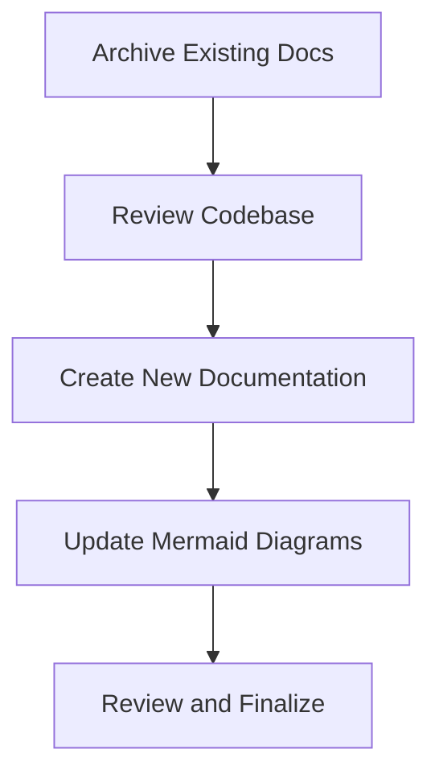

# Documentation Restructuring and Update Plan

**Date:** April 28, 2025

## Overview

This document outlines the plan to archive existing documentation and create new, accurate documentation that reflects the current state of the codebase. The goal is to provide clear, concise documentation for all system components without aspirational content, using a flat structure with clear naming conventions.

## Project Phases



### Phase 1: Archive Existing Documentation

- Create `docs/old/` directory
- Move all existing documentation files from `docs/` to `docs/old/`
- Create an index file in `docs/old/README.md` for reference

### Phase 2: Codebase Review

- Review each component's implementation in the source code:
  - `crates/gini-core/src/kernel/`
  - `crates/gini-core/src/event/`
  - `crates/gini-core/src/plugin_system/`
  - `crates/gini-core/src/stage_manager/`
  - `crates/gini-core/src/storage/`
  - `crates/gini-core/src/ui_bridge/`
  - `crates/gini/src/`
- Extract key interfaces, relationships, and behavior
- Note discrepancies between existing documentation and implementation

### Phase 3: Create New Documentation

Create documentation files with a flat structure:

```
docs/
├── README.md                    # Main documentation entry point
├── architecture.md              # Overall system architecture
├── kernel-system.md             # Kernel component system
├── event-system.md              # Event system
├── plugin-system.md             # Plugin system
├── stage-manager.md             # Stage manager
├── storage-system.md            # Storage system
├── ui-bridge.md                 # UI bridge
├── setup-guide.md               # Development environment setup
├── testing-guide.md             # Testing workflow
├── plugin-creation-guide.md     # How to create plugins
├── contributing.md              # Contributing guidelines
└── api-reference.md             # Public API reference
```

### Phase 4: Update Mermaid Diagrams

- Extract and preserve Mermaid diagrams from existing docs
- Update each diagram to accurately reflect current implementation
- Include updated diagrams in appropriate new documentation files

### Phase 5: Review and Finalize

- Ensure all documentation is based on actual implementation
- Check for consistency in terminology and style
- Verify all links and references
- Proofread all content

## Documentation Structure

Each component documentation file will follow this consistent structure:

```
# Component Name

## Overview
Brief description of the component's purpose and role in the system.

## Architecture
Updated Mermaid diagram showing component structure.

## Core Interfaces
Key interfaces defining the component's API.

## Implementation Details
Brief overview of actual implementation.

## Usage Examples
Short, practical code examples extracted from the codebase.

## Related Components
How this component interacts with other system components.
```

## Documentation Principles

1. **Accuracy:** Base all documentation strictly on the current implementation
2. **Conciseness:** Focus on clarity rather than length
3. **Practicality:** Include real code examples from the codebase
4. **Completeness:** Cover all core components equally
5. **Visual Aids:** Use updated Mermaid diagrams to illustrate concepts

## Project Timeline

| Phase | Task | Estimated Time |
|-------|------|----------------|
| 1 | Archive existing documentation | 0.5 days |
| 2 | Thorough codebase review | 3 days |
| 3 | Create new documentation files | 4 days |
| 4 | Update Mermaid diagrams | 1 day |
| 5 | Review and finalize | 1.5 days |
| | **Total** | **10 days** |

## Deliverables

1. Archived original documentation in `docs/old/`
2. New top-level README.md with project overview
3. Component-specific documentation files
4. Updated Mermaid diagrams reflecting actual implementation
5. Developer guides for setup, testing, plugin creation, and contributing