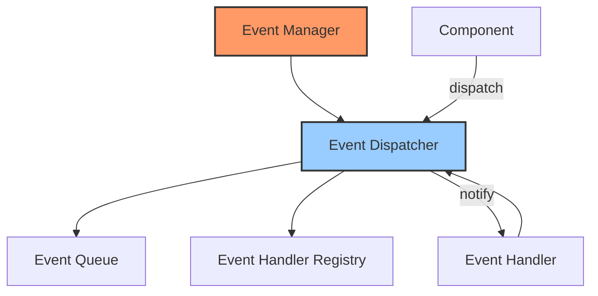

# Event System

## Overview

The event system enables asynchronous communication between different components of the application. It provides a way for components to dispatch events and for other components to handle those events without direct coupling.

## Architecture



## Core Components

### Event Types

The event system is built around the `Event` trait which defines the interface for all events:

```rust
pub trait Event: Send + Sync + Debug {
    fn event_type(&self) -> &'static str;
    fn as_any(&self) -> &dyn Any;
}
```

Events are identified by their type string, which allows for dynamic dispatch to appropriate handlers.

### Event Dispatcher

The event dispatcher is responsible for receiving events and dispatching them to registered handlers:

```rust
pub struct EventDispatcher {
    handlers: HashMap<String, Vec<HandlerEntry>>,
    next_id: AtomicU64,
}
```

It provides methods to:
- Register handlers for specific event types
- Unregister handlers
- Dispatch events to matching handlers

### Event Manager

The event manager is the kernel component that provides access to the event system:

```rust
pub struct EventManager {
    dispatcher: Arc<Mutex<EventDispatcher>>,
}
```

It implements the `KernelComponent` trait and manages the lifecycle of the event system.

## Handler Registration

Handlers can be registered for specific event types:

```rust
pub async fn register_handler<F>(&self, event_type: &str, handler: F) -> HandlerId
where
    F: Fn(&dyn Event) -> EventResult + Send + 'static,
{
    let mut dispatcher = self.dispatcher.lock().await;
    dispatcher.register_handler(event_type, handler)
}
```

Each handler receives a unique `HandlerId` that can be used to unregister it later.

## Event Dispatching

Events are dispatched asynchronously:

```rust
pub async fn dispatch(&self, event: &dyn Event) -> Vec<EventResult> {
    let dispatcher = self.dispatcher.lock().await;
    dispatcher.dispatch(event).await
}
```

The dispatcher finds all handlers registered for the event's type and invokes them with the event object.

## Asynchronous Handling

Handlers can be either synchronous or asynchronous:

```rust
#[async_trait]
pub trait AsyncEventHandler: Send + Sync {
    async fn handle_event(&self, event: &dyn Event) -> EventResult;
}

pub trait EventHandler: Send + Sync {
    fn handle_event(&self, event: &dyn Event) -> EventResult;
}
```

The system supports both types of handlers, automatically wrapping synchronous handlers as needed.

## Error Handling

Event handling errors are captured through the `EventResult` type:

```rust
pub type EventResult = Result<(), EventError>;

#[derive(Debug, thiserror::Error)]
pub enum EventError {
    #[error("Handler execution error: {0}")]
    HandlerError(String),
    
    #[error("Event not handled: {0}")]
    NotHandled(String),
    
    // Other variants
}
```

## Usage Example

Registering an event handler:

```rust
let event_manager = app.get_component::<EventManager>().unwrap();

// Register a handler for "config.changed" events
let handler_id = event_manager
    .register_handler("config.changed", |event| {
        if let Some(config_event) = event.as_any().downcast_ref::<ConfigChangedEvent>() {
            println!("Config changed: {}", config_event.key);
            Ok(())
        } else {
            Err(EventError::HandlerError("Invalid event type".to_string()))
        }
    })
    .await;
```

Dispatching an event:

```rust
let event = ConfigChangedEvent {
    key: "theme".to_string(),
    value: "dark".to_string(),
};

event_manager.dispatch(&event).await?;
```

## Integration with Components

Components can both dispatch and handle events, allowing for loose coupling:

- Plugins can dispatch events to notify the system of changes
- Components can listen for events from other parts of the system
- The UI can react to events from the core system

This approach creates a flexible, reactive architecture where components interact through well-defined events rather than direct method calls.