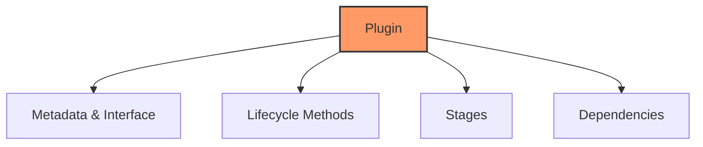

# Plugin Creation Guide

## Overview

This guide will walk you through creating a custom plugin for the Gini system. Plugins allow you to extend the functionality of Gini with new features and capabilities.

## Plugin Basics



### Plugin Structure

A plugin consists of:

1. **Plugin Implementation**: A Rust struct that implements the `Plugin` trait
2. **Library Entry Point**: A function to create and return the plugin instance
3. **Stages**: Custom stages that the plugin contributes to the system

## Creating a Plugin

### Step 1: Create a New Crate

Start by creating a new Cargo project:

```bash
cargo new --lib my-plugin
cd my-plugin
```

Update `Cargo.toml` to include the required dependencies:

```toml
[package]
name = "my-plugin"
version = "0.1.0"
edition = "2021"

[dependencies]
gini-core = { path = "../path/to/gini-core" }
async-trait = "0.1"

[lib]
crate-type = ["cdylib"]  # Create a dynamic library
```

### Step 2: Implement the Plugin Trait

Create your plugin implementation in `src/lib.rs`:

```rust
use gini_core::plugin_system::{Plugin, PluginPriority, PluginDependency, ApiVersion, VersionRange};
use gini_core::stage_manager::{StageRequirement, Stage};
use gini_core::kernel::Application;
use std::error::Error;

pub struct MyPlugin {
    // Plugin state
}

impl MyPlugin {
    pub fn new() -> Self {
        Self { }
    }
}

impl Plugin for MyPlugin {
    fn name(&self) -> &'static str {
        "my-plugin"
    }
    
    fn version(&self) -> &str {
        "0.1.0"
    }
    
    fn is_core(&self) -> bool {
        false  // Set to true only for core plugins
    }
    
    fn priority(&self) -> PluginPriority {
        PluginPriority::ThirdParty(150)  // Standard third-party plugin
    }
    
    fn compatible_api_versions(&self) -> Vec<VersionRange> {
        vec![VersionRange {
            min: ApiVersion::new(1, 0, 0),
            max: ApiVersion::new(1, 99, 99),
        }]
    }
    
    fn dependencies(&self) -> Vec<PluginDependency> {
        vec![
            PluginDependency {
                plugin_name: "storage-manager".to_string(),
                version_range: VersionRange {
                    min: ApiVersion::new(1, 0, 0),
                    max: ApiVersion::new(1, 99, 99),
                },
                required: true,
            }
        ]
    }
    
    fn required_stages(&self) -> Vec<StageRequirement> {
        vec![]  // No specific stage requirements
    }
    
    fn init(&self, app: &mut Application) -> Result<(), Box<dyn Error>> {
        // Initialize plugin resources
        println!("Initializing MyPlugin");
        Ok(())
    }
    
    fn stages(&self) -> Vec<Box<dyn Stage>> {
        // Return custom stages provided by this plugin
        vec![
            Box::new(MyCustomStage::new()),
        ]
    }
    
    fn shutdown(&self) -> Result<(), Box<dyn Error>> {
        // Clean up resources
        println!("Shutting down MyPlugin");
        Ok(())
    }
}

// Add the plugin initialization function for dynamic loading
#[no_mangle]
pub extern "C" fn _plugin_init() -> *mut dyn Plugin {
    // Create the plugin instance
    let plugin = Box::new(MyPlugin::new());
    // Convert to raw pointer
    Box::into_raw(plugin)
}
```

### Step 3: Create Custom Stages

Implement custom stages for your plugin:

```rust
use gini_core::stage_manager::{Stage, StageContext, StageResult, StageDependency};
use async_trait::async_trait;

pub struct MyCustomStage {
    // Stage state
}

impl MyCustomStage {
    pub fn new() -> Self {
        Self { }
    }
}

#[async_trait]
impl Stage for MyCustomStage {
    fn name(&self) -> &str {
        "my-plugin.custom-stage"
    }
    
    fn dependencies(&self) -> Vec<StageDependency> {
        // Specify dependencies on other stages
        vec![]
    }
    
    async fn execute(&self, context: &mut StageContext) -> StageResult {
        println!("Executing MyCustomStage");
        
        // Access storage
        let storage = context.storage_provider();
        
        // Access configuration
        if let Some(config) = context.get_config("my-plugin.settings") {
            println!("Found configuration: {:?}", config);
        }
        
        // Demonstrate dry run mode
        if context.is_dry_run() {
            context.record_dry_run_operation("Would perform operation X");
            return Ok(());
        }
        
        // Perform actual work
        // ...
        
        Ok(())
    }
    
    fn dry_run_description(&self) -> String {
        "Would execute custom operation from MyPlugin".to_string()
    }
}
```

### Step 4: Build the Plugin

Build the plugin library:

```bash
cargo build --release
```

The compiled plugin will be available at `target/release/libmy_plugin.so` (Linux) or `target/release/my_plugin.dll` (Windows).

## Plugin Lifecycle

A plugin goes through the following lifecycle stages:

1. **Loading**: The plugin's shared library is loaded by the plugin manager
2. **Registration**: The plugin is registered with the system
3. **Initialization**: The `init()` method is called
4. **Stage Registration**: The plugin's stages are registered with the stage manager
5. **Execution**: The plugin's stages are executed as part of pipelines
6. **Shutdown**: The `shutdown()` method is called when the application exits

## Plugin Manifest Example

For better metadata, you can also define a manifest for your plugin:

```toml
[plugin]
name = "my-plugin"
version = "0.1.0"
author = "Your Name"
description = "Example custom plugin for Gini"
core = false
priority = "third-party:150"

[compatibility]
kernel_api = "^1.0.0"

[dependencies]
storage-manager = ">=1.0.0"

[stage_requirements]
provides = ["my-plugin.custom-stage"]
```

## Advanced Plugin Features

### Event Handling

To handle events in your plugin:

```rust
fn init(&self, app: &mut Application) -> Result<(), Box<dyn Error>> {
    // Get the event manager
    if let Some(event_manager) = app.get_component::<EventManager>() {
        // Register a handler for a specific event type
        event_manager.register_handler("config.changed", move |event| {
            if let Some(config_event) = event.as_any().downcast_ref::<ConfigChangedEvent>() {
                println!("Config changed: {}", config_event.key);
            }
            Ok(())
        }).await?;
    }
    
    Ok(())
}
```

### Storage Access

To access storage from your plugin:

```rust
fn init(&self, app: &mut Application) -> Result<(), Box<dyn Error>> {
    // Get the storage manager
    if let Some(storage_manager) = app.get_component::<StorageManager>() {
        // Use the storage provider
        let provider = storage_manager.provider();
        
        // Check if a file exists
        if provider.file_exists(Path::new("config/my-plugin.json"))? {
            // Read the file
            let content = provider.read_file_to_string(Path::new("config/my-plugin.json"))?;
            println!("Loaded configuration: {}", content);
        } else {
            // Create default configuration
            provider.write_file_from_string(
                Path::new("config/my-plugin.json"),
                "{\"enabled\": true}"
            )?;
        }
    }
    
    Ok(())
}
```

### Plugin Dependencies

To declare dependencies on other plugins:

```rust
fn dependencies(&self) -> Vec<PluginDependency> {
    vec![
        PluginDependency {
            plugin_name: "storage-manager".to_string(),
            version_range: VersionRange {
                min: ApiVersion::new(1, 0, 0),
                max: ApiVersion::new(1, 99, 99),
            },
            required: true,
        },
        PluginDependency {
            plugin_name: "ui-manager".to_string(),
            version_range: VersionRange {
                min: ApiVersion::new(1, 0, 0),
                max: ApiVersion::new(1, 99, 99),
            },
            required: false,  // Optional dependency
        }
    ]
}
```

## Testing Your Plugin

Create tests for your plugin:

```rust
#[cfg(test)]
mod tests {
    use super::*;
    
    #[test]
    fn test_plugin_creation() {
        let plugin = MyPlugin::new();
        assert_eq!(plugin.name(), "my-plugin");
        assert_eq!(plugin.version(), "0.1.0");
        assert!(!plugin.is_core());
    }
    
    #[tokio::test]
    async fn test_stage_execution() {
        let stage = MyCustomStage::new();
        let mut context = TestStageContext::new();
        
        let result = stage.execute(&mut context).await;
        assert!(result.is_ok());
    }
}
```

## Deployment

To deploy your plugin:

1. Build the plugin using `cargo build --release`
2. Copy the compiled library to the Gini plugins directory:
   ```bash
   cp target/release/libmy_plugin.so ~/.gini/user/plugins/
   ```
3. Restart Gini to load the new plugin

## Best Practices

1. **Follow the Single Responsibility Principle**: Each plugin should have a clear, focused purpose
2. **Version Compatibility**: Clearly specify compatible API versions
3. **Error Handling**: Use proper error handling and propagation
4. **Resource Management**: Clean up resources in the `shutdown()` method
5. **Testing**: Write comprehensive tests for your plugin
6. **Documentation**: Document your plugin's features and requirements