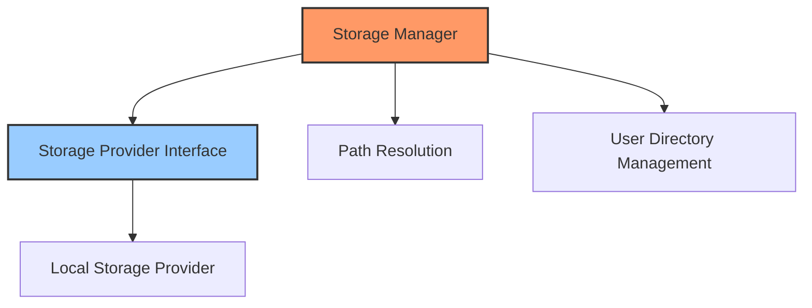

# Storage System

## Overview

The Storage System provides a unified interface for file system operations and storage management. It abstracts the underlying storage details, making it easier to work with files across different storage types and locations.

## Architecture



## Core Components

### Storage Provider Interface

The `StorageProvider` trait defines the interface for all storage implementations:

```rust
pub trait StorageProvider: Send + Sync {
    /// Check if a file exists
    fn file_exists(&self, path: &Path) -> Result<bool>;
    
    /// Read a file to a string
    fn read_file_to_string(&self, path: &Path) -> Result<String>;
    
    /// Read a file to a byte vector
    fn read_file_to_bytes(&self, path: &Path) -> Result<Vec<u8>>;
    
    /// Write a string to a file
    fn write_file_from_string(&self, path: &Path, content: &str) -> Result<()>;
    
    /// Write bytes to a file
    fn write_file_from_bytes(&self, path: &Path, bytes: &[u8]) -> Result<()>;
    
    /// Create a directory and all parent directories
    fn create_dir_all(&self, path: &Path) -> Result<()>;
    
    /// Remove a file
    fn remove_file(&self, path: &Path) -> Result<()>;
    
    /// Remove a directory
    fn remove_dir(&self, path: &Path) -> Result<()>;
    
    /// Remove a directory and all its contents
    fn remove_dir_all(&self, path: &Path) -> Result<()>;
    
    /// List files in a directory
    fn list_dir(&self, path: &Path) -> Result<Vec<PathBuf>>;
    
    /// Copy a file
    fn copy_file(&self, src: &Path, dst: &Path) -> Result<()>;
    
    /// Move a file
    fn move_file(&self, src: &Path, dst: &Path) -> Result<()>;
}
```

### Storage Manager

The storage manager is the kernel component that provides access to storage operations:

```rust
pub struct StorageManager {
    base_path: PathBuf,
    user_path: PathBuf,
    provider: Box<dyn StorageProvider>,
}
```

It implements the `KernelComponent` trait and manages application paths and storage access.

### Local Storage Provider

The default implementation for local filesystem storage:

```rust
pub struct LocalStorageProvider {
    base_path: PathBuf,
}

impl StorageProvider for LocalStorageProvider {
    fn file_exists(&self, path: &Path) -> Result<bool> {
        let full_path = self.resolve_path(path);
        Ok(full_path.exists() && full_path.is_file())
    }
    
    fn read_file_to_string(&self, path: &Path) -> Result<String> {
        let full_path = self.resolve_path(path);
        fs::read_to_string(&full_path)
            .map_err(|e| Error::Storage(format!("Failed to read file {:?}: {}", path, e)))
    }
    
    // Other method implementations...
}
```

## Path Resolution

The storage system handles both absolute and relative paths:

```rust
impl LocalStorageProvider {
    fn resolve_path(&self, path: &Path) -> PathBuf {
        if path.is_absolute() {
            path.to_path_buf()
        } else {
            self.base_path.join(path)
        }
    }
}
```

## User Directory Management

The storage manager creates and manages user-specific directories:

```rust
impl StorageManager {
    pub fn new(base_path: PathBuf) -> Result<Self> {
        // Calculate user path (usually ./user)
        let user_path = base_path.join("user");
        
        // Create the local storage provider
        let provider = Box::new(LocalStorageProvider::new(base_path.clone()));
        
        // Ensure user directory exists
        provider.create_dir_all(&user_path)?;
        
        Ok(Self {
            base_path,
            user_path,
            provider,
        })
    }
    
    pub fn user_path(&self) -> &Path {
        &self.user_path
    }
    
    pub fn user_config_path(&self) -> PathBuf {
        self.user_path.join("config")
    }
    
    pub fn user_data_path(&self) -> PathBuf {
        self.user_path.join("data")
    }
    
    pub fn user_plugins_path(&self) -> PathBuf {
        self.user_path.join("plugins")
    }
}
```

## Error Handling

Storage operations capture errors through the `StorageError` type:

```rust
#[derive(Debug, thiserror::Error)]
pub enum StorageError {
    #[error("File not found: {0}")]
    FileNotFound(PathBuf),
    
    #[error("Access denied: {0}")]
    AccessDenied(PathBuf),
    
    #[error("IO error for {path}: {error}")]
    IoError { path: PathBuf, error: String },
    
    #[error("Invalid path: {0}")]
    InvalidPath(String),
    
    #[error("Other storage error: {0}")]
    Other(String),
}

pub type StorageResult<T> = Result<T, StorageError>;
```

## Usage Example

Basic file operations:

```rust
let storage_manager = app.get_component::<StorageManager>().unwrap();
let provider = storage_manager.provider();

// Reading a file
let content = provider.read_file_to_string(Path::new("config.json"))?;

// Writing a file
provider.write_file_from_string(Path::new("output.txt"), "Hello, world!")?;

// Creating directories
provider.create_dir_all(Path::new("data/logs"))?;

// Working with user directories
let user_config_path = storage_manager.user_config_path();
provider.write_file_from_string(&user_config_path.join("settings.json"), "{}")?;
```

## Integration with Other Components

The storage system is used by various other components:

- **Plugin System**: Loading plugin files and manifests
- **Configuration Management**: Storing and loading configuration files
- **Stage Manager**: Reading and writing files during stage execution
- **Recovery System**: Creating backups and recovery points

It provides a foundation for all file-based operations in the application, ensuring consistent access patterns and error handling.