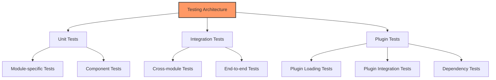

# Testing Guide

## Overview

This guide describes the testing approach used in the Gini project, including how to run existing tests, write new tests, and follow testing best practices.

## Testing Architecture

The project uses a multi-layered testing approach:



## Test Organization

Tests are organized in a consistent structure throughout the codebase:

- **Unit Tests**: Located within each module in a `tests` directory
- **Integration Tests**: Located in `crates/gini-core/src/tests/integration`
- **Plugin Tests**: Located in both plugin directories and integration test directories

### Directory Structure

```
crates/gini-core/src/
├── module/
│   ├── module.rs
│   └── tests/
│       ├── mod.rs
│       └── module_tests.rs
└── tests/
    ├── mod.rs
    └── integration/
        ├── mod.rs
        ├── module_tests.rs
        └── plugins/
            ├── mod.rs
            └── plugin_tests.rs
```

## Running Tests

### Running All Tests

To run all tests in the project:

```bash
cargo test
```

### Running Specific Tests

To run tests for a specific module:

```bash
cargo test --package gini-core --lib event::tests
```

To run a specific test by name:

```bash
cargo test test_event_dispatcher
```

To run tests with a specific pattern:

```bash
cargo test dispatch
```

### Test Output Control

To show output from tests (including `println!` statements):

```bash
cargo test -- --nocapture
```

To run tests one at a time (useful for tests that might interfere with each other):

```bash
cargo test -- --test-threads=1
```

## Writing Tests

### Unit Tests

Unit tests focus on testing individual functions or components in isolation:

```rust
#[cfg(test)]
mod tests {
    use super::*;
    
    #[test]
    fn test_event_dispatch() {
        // Setup
        let dispatcher = EventDispatcher::new();
        let mut handler_called = false;
        
        // Register handler
        dispatcher.register_handler("test.event", |_| {
            handler_called = true;
            Ok(())
        });
        
        // Create and dispatch event
        let event = TestEvent::new("test.event");
        dispatcher.dispatch(&event).expect("Failed to dispatch event");
        
        // Verify
        assert!(handler_called, "Handler was not called");
    }
}
```

### Integration Tests

Integration tests verify that different components work together correctly:

```rust
#[tokio::test]
async fn test_plugin_with_event_system() {
    // Setup test environment
    let app = TestApplication::new().await;
    
    // Load plugin
    app.plugin_manager()
        .load_plugin(Path::new("./test_plugins/event_plugin.so"))
        .await
        .expect("Failed to load plugin");
    
    // Create event
    let event = TestEvent::new("plugin.test");
    
    // Dispatch event
    let results = app.event_manager()
        .dispatch(&event)
        .await
        .expect("Failed to dispatch event");
    
    // Verify plugin handler was called
    assert_eq!(results.len(), 1);
    assert!(results[0].is_ok());
}
```

### Async Tests

For asynchronous tests, use the `#[tokio::test]` attribute:

```rust
#[tokio::test]
async fn test_async_operation() {
    // Setup
    let manager = AsyncManager::new();
    
    // Perform async operation
    let result = manager.process().await;
    
    // Verify
    assert!(result.is_ok());
}
```

### Mock Objects

Use mock objects to isolate tests:

```rust
struct MockStorageProvider {
    files: HashMap<PathBuf, Vec<u8>>,
}

impl StorageProvider for MockStorageProvider {
    fn file_exists(&self, path: &Path) -> Result<bool> {
        Ok(self.files.contains_key(&path.to_path_buf()))
    }
    
    fn read_file_to_bytes(&self, path: &Path) -> Result<Vec<u8>> {
        self.files.get(&path.to_path_buf())
            .cloned()
            .ok_or_else(|| Error::Storage(format!("File not found: {:?}", path)))
    }
    
    // Other method implementations...
}

#[test]
fn test_with_mock_storage() {
    let mut mock_storage = MockStorageProvider { files: HashMap::new() };
    mock_storage.files.insert(PathBuf::from("test.txt"), b"Hello, world!".to_vec());
    
    let manager = StorageManager::with_provider(Box::new(mock_storage));
    
    assert!(manager.file_exists(Path::new("test.txt")).unwrap());
    assert_eq!(
        manager.read_file_to_string(Path::new("test.txt")).unwrap(),
        "Hello, world!"
    );
}
```

## Test Context

For complex tests, use a test context to set up and tear down test resources:

```rust
struct TestContext {
    temp_dir: TempDir,
    app: Application,
}

impl TestContext {
    async fn new() -> Self {
        let temp_dir = TempDir::new().unwrap();
        let app = Application::new(temp_dir.path().to_path_buf());
        app.initialize().await.unwrap();
        
        Self { temp_dir, app }
    }
}

impl Drop for TestContext {
    fn drop(&mut self) {
        // Cleanup will happen automatically when temp_dir is dropped
    }
}

#[tokio::test]
async fn test_with_context() {
    let ctx = TestContext::new().await;
    
    // Test using ctx.app
    // ...
    
    // Context will be automatically cleaned up when ctx goes out of scope
}
```

## Testing Best Practices

1. **Test Independence**: Each test should be independent and not rely on the state from previous tests
2. **Clear Naming**: Use descriptive test names that indicate what is being tested
3. **Arrange-Act-Assert**: Structure tests with clear setup, action, and verification phases
4. **Test Edge Cases**: Include tests for error conditions and edge cases
5. **Clean Up**: Always clean up resources created during tests
6. **Mock External Dependencies**: Use mocks for filesystem, network, or other external dependencies
7. **Test Coverage**: Aim for high test coverage, especially for critical code paths

## Plugin Testing

### Testing Plugin Loading

```rust
#[tokio::test]
async fn test_plugin_loading() {
    let plugin_manager = DefaultPluginManager::new().unwrap();
    plugin_manager.initialize().await.unwrap();
    
    let result = plugin_manager
        .load_plugin(Path::new("./test_plugins/valid_plugin.so"))
        .await;
    
    assert!(result.is_ok());
    assert!(plugin_manager.is_plugin_loaded("valid_plugin").await.unwrap());
}
```

### Testing Plugin Dependencies

```rust
#[tokio::test]
async fn test_plugin_dependencies() {
    let plugin_manager = DefaultPluginManager::new().unwrap();
    plugin_manager.initialize().await.unwrap();
    
    // Load plugins
    plugin_manager.load_plugin(Path::new("./test_plugins/base_plugin.so")).await.unwrap();
    plugin_manager.load_plugin(Path::new("./test_plugins/dependent_plugin.so")).await.unwrap();
    
    // Check dependencies
    let dependencies = plugin_manager
        .get_plugin_dependencies("dependent_plugin")
        .await
        .unwrap();
    
    assert_eq!(dependencies.len(), 1);
    assert_eq!(dependencies[0], "base_plugin");
}
```

## Code Coverage

The project uses `grcov` to collect and report code coverage information. Coverage reports are automatically generated by the CI pipeline when you push to `main`, `dev`, or `staging` branches, or when you open a pull request targeting those branches.

### How Code Coverage Works

1. The CI workflow instruments the code with LLVM coverage profiling
2. Tests are executed, generating raw coverage data
3. `grcov` processes the data to create readable reports
4. Reports are published as artifacts and on GitHub Pages

### Viewing Coverage Reports

To view the latest coverage reports:

- **PR Coverage**: Coverage information is automatically commented on pull requests
- **Main Branch Coverage**: The latest main branch coverage is published to GitHub Pages
- **Local Coverage**: You can generate and view coverage locally (see below)

### Running Coverage Locally

To generate coverage reports locally:

```bash
# Set environment variables for coverage instrumentation
export LLVM_PROFILE_FILE="target/coverage/%p-%m.profraw"
export CARGO_INCREMENTAL=0
export RUSTFLAGS="-Cinstrument-coverage"

# Run tests
cargo test --workspace

# Generate coverage report
mkdir -p target/coverage
grcov target/coverage --binary-path target/debug -s . -o target/coverage \
  --keep-only 'src/*' --ignore-not-existing --output-types html,cobertura

# View HTML report
open target/coverage/html/index.html
```

### Coverage Standards

We aim to maintain at least:

- 80% line coverage for core components
- 70% line coverage for the codebase overall
- 100% coverage for critical paths

PRs that significantly decrease coverage will be flagged for review.

## Continuous Integration

The project uses CI to automatically run tests on each commit and pull request:

1. **Unit Tests**: Fast tests run on every commit
2. **Integration Tests**: Run on PRs and main branch commits
3. **Coverage Reports**: Generated to track test coverage

To run the same tests locally that CI runs:

```bash
cargo test --workspace --all-features