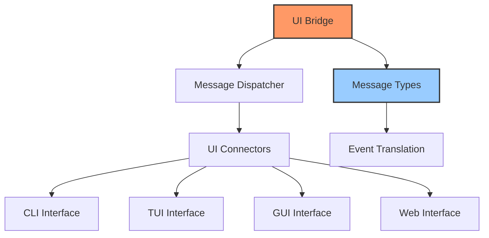

# UI Bridge

## Overview

The UI Bridge provides a minimal abstraction layer between the core system and user interfaces. It enables communication between the backend and various UI implementations without direct coupling, allowing for different UI technologies to be used interchangeably.

## Architecture



## Core Components

### Message Types

The UI bridge defines a set of message types for communication between the core and UI:

```rust
#[derive(Debug, Clone)]
pub enum UiMessage {
    // Notifications
    Info(String),
    Warning(String),
    Error(String),
    
    // Progress updates
    ProgressStart { id: String, total: usize },
    ProgressUpdate { id: String, current: usize },
    ProgressComplete { id: String },
    
    // Data updates
    DataUpdate { key: String, value: Value },
    
    // Status changes
    StatusChange { status: SystemStatus },
    
    // Special updates
    DashboardUpdate(DashboardData),
    
    // Requests for input
    RequestInput { prompt: String, options: Vec<String> },
}
```

### UI Manager

The UI manager is the kernel component that provides access to the UI bridge:

```rust
pub struct UIManager {
    dispatcher: Arc<MessageDispatcher>,
}

impl UIManager {
    pub fn send_message(&self, message: UiMessage) -> Result<()> {
        self.dispatcher.dispatch(message)
    }
    
    pub fn register_connector(&self, connector: Box<dyn UiConnector>) -> Result<ConnectorId> {
        self.dispatcher.register_connector(connector)
    }
    
    pub fn unregister_connector(&self, id: ConnectorId) -> Result<()> {
        self.dispatcher.unregister_connector(id)
    }
}
```

### Message Dispatcher

The dispatcher sends UI messages to registered connectors:

```rust
struct MessageDispatcher {
    connectors: RwLock<HashMap<ConnectorId, Box<dyn UiConnector>>>,
    next_id: AtomicU64,
}

impl MessageDispatcher {
    fn dispatch(&self, message: UiMessage) -> Result<()> {
        let connectors = self.connectors.read().unwrap();
        
        for connector in connectors.values() {
            if let Err(e) = connector.handle_message(&message) {
                // Log error but continue to other connectors
                eprintln!("Error dispatching message to connector: {}", e);
            }
        }
        
        Ok(())
    }
}
```

### UI Connector Interface

The `UiConnector` trait defines the interface for UI implementations:

```rust
pub trait UiConnector: Send + Sync {
    fn handle_message(&self, message: &UiMessage) -> Result<()>;
    fn send_input(&self, input: UserInput) -> Result<()>;
    fn name(&self) -> &str;
    fn supports_feature(&self, feature: UiFeature) -> bool;
}
```

## UI Features

Different UIs support different features:

```rust
pub enum UiFeature {
    CommandInput,
    GraphicalDisplay,
    InteractiveNavigation,
    ProgressReporting,
    TableDisplay,
    FilePreview,
    RichText,
}
```

## User Input Handling

User input is sent back from the UI to the core system:

```rust
#[derive(Debug)]
pub enum UserInput {
    Command { text: String },
    ButtonPress { id: String },
    FormSubmit { form_id: String, values: HashMap<String, String> },
    Selection { options: Vec<String>, selected_index: usize },
    Cancel,
}
```

## Message Flow

The system supports bidirectional communication:

1. **Core to UI**: The core sends UiMessage objects to update UI state
2. **UI to Core**: UI sends UserInput objects to communicate user actions

## Status Reporting

The UI bridge allows reporting system status:

```rust
#[derive(Debug, Clone, PartialEq, Eq)]
pub enum SystemStatus {
    Starting,
    Ready,
    Processing,
    Error,
    ShuttingDown,
}
```

## Progress Reporting

Long-running operations can report progress to the UI:

```rust
// Start a progress operation
ui_manager.send_message(UiMessage::ProgressStart {
    id: "vm_creation".to_string(),
    total: 100,
})?;

// Update progress
ui_manager.send_message(UiMessage::ProgressUpdate {
    id: "vm_creation".to_string(),
    current: 50,
})?;

// Complete the operation
ui_manager.send_message(UiMessage::ProgressComplete {
    id: "vm_creation".to_string(),
})?;
```

## Integration with Event System

The UI bridge can translate UI events to system events:

```rust
impl UiConnector for CliConnector {
    fn handle_message(&self, message: &UiMessage) -> Result<()> {
        // Display the message to user
        // ...
        
        Ok(())
    }
    
    fn send_input(&self, input: UserInput) -> Result<()> {
        // Convert UI input to system event
        match input {
            UserInput::Command { text } => {
                let event = CommandEvent { command: text };
                self.event_dispatcher.dispatch(&event)?;
            },
            // Other input types...
        }
        
        Ok(())
    }
}
```

## UI Implementation Examples

The UI bridge supports different UI implementations:

### CLI Interface

```rust
pub struct CliConnector {
    event_dispatcher: Arc<dyn EventDispatcher>,
}

impl UiConnector for CliConnector {
    fn handle_message(&self, message: &UiMessage) -> Result<()> {
        match message {
            UiMessage::Info(text) => println!("INFO: {}", text),
            UiMessage::Warning(text) => println!("WARNING: {}", text),
            UiMessage::Error(text) => println!("ERROR: {}", text),
            // Other message types...
        }
        
        Ok(())
    }
    
    // Other method implementations...
}
```

### TUI Interface

```rust
pub struct TuiConnector {
    event_dispatcher: Arc<dyn EventDispatcher>,
    app_state: Arc<Mutex<TuiAppState>>,
}

impl UiConnector for TuiConnector {
    fn handle_message(&self, message: &UiMessage) -> Result<()> {
        let mut app_state = self.app_state.lock().unwrap();
        
        match message {
            UiMessage::Info(text) => app_state.add_log(LogLevel::Info, text),
            UiMessage::StatusChange { status } => app_state.set_status(status),
            UiMessage::ProgressUpdate { id, current } => app_state.update_progress(id, current),
            // Other message types...
        }
        
        Ok(())
    }
    
    // Other method implementations...
}
```

## Minimal Implementation

The current UI bridge is intentionally minimal, focusing on the core messaging interface rather than specific UI implementations. This allows for flexibility in choosing UI technologies while maintaining a consistent communication pattern.