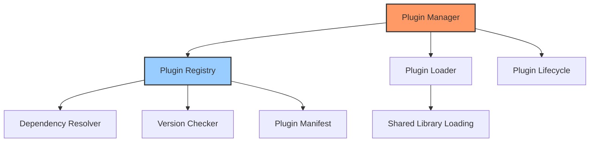
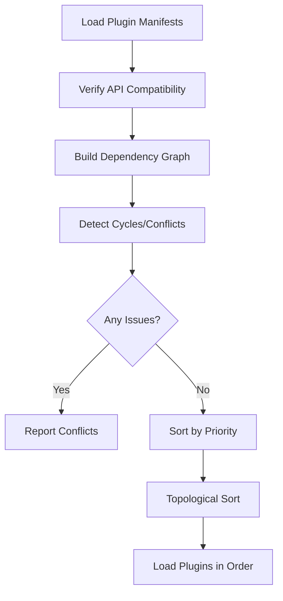

# Plugin System

## Overview

The plugin system is the foundation of Gini's "Everything is a Plugin" architecture. It manages the loading, registration, and lifecycle of plugins, which are modular components that provide most of the application's functionality.

## Architecture



## Core Components

### Plugin Interface

The `Plugin` trait defines the interface that all plugins must implement:

```rust
pub trait Plugin: Send + Sync {
    fn name(&self) -> &'static str;
    fn version(&self) -> &str;
    fn is_core(&self) -> bool;
    fn priority(&self) -> PluginPriority;
    
    // Compatible API versions
    fn compatible_api_versions(&self) -> Vec<VersionRange>;
    
    // Plugin dependencies
    fn dependencies(&self) -> Vec<PluginDependency>;
    
    // Stage requirements
    fn required_stages(&self) -> Vec<StageRequirement>;
    
    // Lifecycle methods
    fn init(&self, app: &mut Application) -> Result<(), PluginError>;
    async fn preflight_check(&self, context: &StageContext) -> Result<(), PluginError>;
    fn stages(&self) -> Vec<Box<dyn Stage>>;
    fn shutdown(&self) -> Result<(), PluginError>;
}
```

### Plugin Manager

The plugin manager is the kernel component that provides access to the plugin system:

```rust
#[async_trait]
pub trait PluginManager: KernelComponent {
    async fn load_plugin(&self, path: &Path) -> Result<()>;
    async fn load_plugins_from_directory(&self, dir: &Path) -> Result<usize>;
    async fn get_plugin(&self, id: &str) -> Result<Option<Arc<dyn Plugin>>>;
    async fn get_plugins(&self) -> Result<Vec<Arc<dyn Plugin>>>;
    async fn get_enabled_plugins(&self) -> Result<Vec<Arc<dyn Plugin>>>;
    async fn is_plugin_loaded(&self, id: &str) -> Result<bool>;
    async fn get_plugin_dependencies(&self, id: &str) -> Result<Vec<String>>;
    async fn get_dependent_plugins(&self, id: &str) -> Result<Vec<String>>;
    async fn enable_plugin(&self, id: &str) -> Result<()>;
    async fn disable_plugin(&self, id: &str) -> Result<()>;
    async fn is_plugin_enabled(&self, id: &str) -> Result<bool>;
    async fn get_plugin_manifest(&self, id: &str) -> Result<Option<PluginManifest>>;
}
```

### Plugin Registry

The registry tracks all loaded plugins and manages their state:

```rust
pub struct PluginRegistry {
    plugins: HashMap<String, Arc<dyn Plugin>>,
    enabled_plugins: HashSet<String>,
    plugin_libraries: Vec<Library>,
    current_api_version: ApiVersion,
}
```

It handles plugin registration, dependency resolution, and version compatibility checks.

### Plugin Loader

The loader is responsible for loading plugin code from shared libraries:

```rust
fn load_so_plugin(&self, path: &Path) -> Result<Box<dyn Plugin>> {
    type PluginInitFn = unsafe extern "C" fn() -> *mut dyn Plugin;
    
    let library = unsafe { Library::new(path) }?;
    let init_symbol: Symbol<PluginInitFn> = unsafe { library.get(b"_plugin_init\0") }?;
    
    let plugin_instance_ptr = match panic::catch_unwind(|| unsafe { init_symbol() }) {
        Ok(ptr) => ptr,
        Err(e) => {
            // Handle panic in plugin initialization
            return Err(Error::Plugin(format!(
                "Plugin initialization panicked in {:?}", path
            )));
        }
    };
    
    let plugin_instance = unsafe { Box::from_raw(plugin_instance_ptr) };
    
    // Prevent library unloading
    std::mem::forget(library);
    
    Ok(plugin_instance)
}
```

## Plugin Priorities

Plugins have a priority that determines their loading and initialization order:

```rust
pub enum PluginPriority {
    Kernel(u8),          // 0-10: Reserved for kernel
    CoreCritical(u8),    // 11-50: Critical core functionality
    Core(u8),            // 51-100: Standard core functionality
    ThirdPartyHigh(u8),  // 101-150: High-priority third-party
    ThirdParty(u8),      // 151-200: Standard third-party
    ThirdPartyLow(u8),   // 201-255: Low-priority third-party
}
```

## API Versioning

The plugin system includes robust versioning to ensure compatibility:

```rust
pub struct ApiVersion {
    pub major: u32,
    pub minor: u32,
    pub patch: u32,
}

pub struct VersionRange {
    pub min: ApiVersion,
    pub max: ApiVersion,
}
```

Compatibility is checked based on semantic versioning rules:

```rust
pub fn is_compatible_with(&self, other: &ApiVersion) -> bool {
    // Same major version and equal or higher minor version
    self.major == other.major && self.minor <= other.minor
}
```

## Plugin Manifests

Each plugin has a manifest that describes its metadata:

```rust
pub struct PluginManifest {
    pub id: String,
    pub name: String,
    pub version: String,
    pub author: String,
    pub description: String,
    pub website: Option<String>,
    pub license: Option<String>,
    pub api_versions: Vec<VersionRange>,
    pub dependencies: Vec<DependencyInfo>,
    pub is_core: bool,
    pub priority: Option<String>,
    pub entry_point: String,
    pub files: Vec<String>,
    pub config_schema: Option<String>,
    pub tags: Vec<String>,
}
```

## Dependency Resolution

The plugin system handles resolving plugin dependencies:



Plugins declare dependencies, which are checked during loading:

```rust
pub struct PluginDependency {
    pub plugin_name: String,
    pub version_range: VersionRange,
    pub required: bool,
}
```

## Plugin Lifecycle

The lifecycle of a plugin consists of several stages:

1. **Loading**: Plugin code is loaded from a shared library
2. **Registration**: Plugin is added to the registry
3. **Pre-flight Check**: Verify the plugin can be initialized 
4. **Initialization**: Plugin's `init()` method is called
5. **Stage Registration**: Plugin's stages are registered with the stage manager
6. **Operation**: Plugin functions during normal application operation
7. **Shutdown**: Plugin's `shutdown()` method is called when the application exits

## Usage Example

Loading and initializing a plugin:

```rust
let plugin_manager = app.get_component::<PluginManager>().unwrap();

// Load a plugin from a file
plugin_manager.load_plugin(Path::new("plugins/example.so")).await?;

// Check if a plugin is loaded
if plugin_manager.is_plugin_loaded("example").await? {
    println!("Example plugin is loaded");
}

// Enable a plugin
plugin_manager.enable_plugin("example").await?;

// Get a reference to the plugin
if let Some(plugin) = plugin_manager.get_plugin("example").await? {
    println!("Plugin version: {}", plugin.version());
}
```

## Core vs. Third-Party Plugins

The system distinguishes between core plugins (shipped with the application) and third-party plugins (installed by users):

- Core plugins have higher priority by default
- Core plugins cannot be disabled
- Third-party plugins can be enabled/disabled at runtime
- Core plugins have strict version compatibility requirements