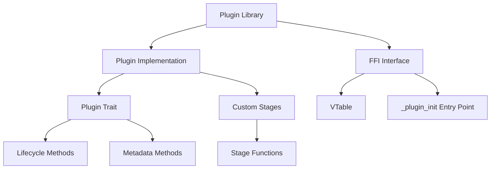

# Plugin System Developer Guide

This guide provides comprehensive information for developers who want to create plugins for the Gini application. It's based on the actual implementation patterns found in the core and example plugins.

## Plugin Architecture Overview

Gini uses a dynamic plugin system that allows extending the application's functionality without modifying its core code. Plugins are loaded at runtime and can interact with the application through well-defined interfaces. The system includes robust error handling, FFI safety mechanisms, and integration with other framework components like the stage system.



## Core Components

### Plugin Trait

Every plugin must implement the `Plugin` trait, which defines the contract between the plugin and the framework. This trait requires implementing several methods for identity, compatibility, lifecycle management, and stage registration.

```rust
use async_trait::async_trait;
use gini_core::plugin_system::{
    Plugin, PluginDependency, PluginPriority, version::VersionRange, error::PluginSystemError
};
use gini_core::stage_manager::{StageContext, requirement::StageRequirement, registry::StageRegistry};
use gini_core::kernel::bootstrap::Application;

#[async_trait]
impl Plugin for MyPlugin {
    // --- Identity Methods ---
    
    // The unique name of the plugin
    fn name(&self) -> &'static str {
        "my-plugin-name"
    }
    
    // The semantic version of the plugin
    fn version(&self) -> &str {
        "0.1.0"
    }
    
    // Whether this is a core plugin (false for third-party plugins)
    fn is_core(&self) -> bool {
        false
    }
    
    // The plugin's priority level, affecting load order
    fn priority(&self) -> PluginPriority {
        PluginPriority::ThirdParty(151) // Standard third-party priority
    }
    
    // --- Compatibility Methods ---
    
    // Core API versions this plugin is compatible with
    fn compatible_api_versions(&self) -> Vec<VersionRange> {
        vec![VersionRange::from_constraint("~0.1.0").expect("Invalid version constraint")]
    }
    
    // Other plugins this plugin depends on
    fn dependencies(&self) -> Vec<PluginDependency> {
        vec![
            // Format: PluginDependency::new(name, version_constraint, required)
            PluginDependency::new("other-plugin", ">=1.0.0", true),
            PluginDependency::new("optional-plugin", ">=0.5.0", false),
        ]
    }
    
    // List of plugin IDs this plugin conflicts with
    fn conflicts_with(&self) -> Vec<String> {
        vec!["conflicting-plugin".to_string()]
    }
    
    // List of plugins and versions this plugin is incompatible with
    fn incompatible_with(&self) -> Vec<PluginDependency> {
        vec![PluginDependency::new("incompatible-plugin", "<2.0.0", true)]
    }
    
    // Stages this plugin requires or provides
    fn required_stages(&self) -> Vec<StageRequirement> {
        vec![
            StageRequirement::require("core:logging"),  // Require this stage to run first
            StageRequirement::provide("my-plugin:custom-stage"),  // We provide this stage
        ]
    }
    
    // --- Lifecycle Methods ---
    
    // Initialize the plugin
    fn init(&self, app: &mut Application) -> Result<(), PluginSystemError> {
        log::info!("Initializing {}", self.name());
        
        // Get application components (optional)
        // let storage = app.get_component::<StorageManager>()?;
        // let event_mgr = app.get_component::<EventManager>()?;
        
        // Perform initialization tasks...
        
        Ok(())
    }
    
    // Perform pre-flight checks to ensure the plugin can run properly
    async fn preflight_check(&self, context: &StageContext) -> Result<(), PluginSystemError> {
        // Check prerequisites, access context for shared data...
        
        // Example of accessing context data
        let config = context.get_data::<MyConfig>("my_plugin:config");
        
        // Example error if a check fails
        if config.is_none() {
            return Err(PluginSystemError::PreflightCheckFailed {
                plugin_id: self.name().to_string(),
                message: "Configuration not found in context".to_string()
            });
        }
        
        Ok(())
    }
    
    // Register custom stages provided by this plugin
    fn register_stages(&self, registry: &mut StageRegistry) -> Result<(), PluginSystemError> {
        // Register any stages this plugin provides
        registry.register_stage(Box::new(MyCustomStage))
            .map_err(|e| PluginSystemError::InternalError(e.to_string()))?;
        
        Ok(())
    }
    
    // Clean up resources when shutting down
    fn shutdown(&self) -> Result<(), PluginSystemError> {
        log::info!("Shutting down {}", self.name());
        
        // Perform cleanup tasks...
        
        Ok(())
    }
}
```

### Custom Stages

Plugins can provide custom stages that integrate with the stage manager system. Stages are registered during plugin initialization and can be executed as part of pipelines.

```rust
use gini_core::stage_manager::{Stage, StageContext};
use std::error::Error as StdError;
use async_trait::async_trait;

struct MyCustomStage;

#[async_trait]
impl Stage for MyCustomStage {
    // Unique stage identifier, should include plugin prefix
    fn id(&self) -> &str {
        "my-plugin:custom-stage"
    }
    
    // Human-readable stage name
    fn name(&self) -> &str {
        "My Custom Stage"
    }
    
    // Stage description
    fn description(&self) -> &str {
        "Performs custom processing for my plugin"
    }
    
    // Core execution logic
    async fn execute(&self, context: &mut StageContext) -> Result<(), Box<dyn StdError + Send + Sync + 'static>> {
        log::info!("Executing {}", self.name());
        
        // Read from context
        if let Some(config) = context.get_data::<MyConfig>("my_plugin:config") {
            // Process data...
        }
        
        // Store data in context for other stages
        let result = MyResult { value: 42 };
        context.set_data("my_plugin:result", result);
        
        Ok(())
    }
}
```

### FFI Interface for Dynamic Loading

For a plugin to be loaded dynamically, it must provide a C-compatible interface. This is implemented through a set of FFI functions and exposed through an entry point function.

```rust
use gini_core::plugin_system::traits::{
    FfiResult, FfiSlice, FfiVersionRange, FfiPluginDependency,
    FfiStageRequirement, PluginVTable, FfiPluginPriority,
};
use std::os::raw::{c_char, c_void};
use std::ffi::CString;
use std::ptr;
use std::panic;

// Entry point - must be #[no_mangle] and pub extern "C"
#[no_mangle]
pub extern "C" fn _plugin_init() -> *mut PluginVTable {
    // Use catch_unwind to prevent panics from crossing FFI boundary
    let result = panic::catch_unwind(|| {
        // Create the plugin instance
        let plugin_instance = Box::new(MyPlugin { _marker: 0 });
        
        // Create the VTable with function pointers
        let vtable = PluginVTable {
            instance: Box::into_raw(plugin_instance) as *mut c_void,
            destroy: ffi_destroy,
            name: ffi_get_name,
            free_name: ffi_free_name,
            version: ffi_get_version,
            free_version: ffi_free_version,
            is_core: ffi_is_core,
            priority: ffi_get_priority,
            compatible_api_versions: ffi_get_compatible_api_versions,
            free_compatible_api_versions: ffi_free_compatible_api_versions,
            dependencies: ffi_get_dependencies,
            free_dependencies: ffi_free_dependencies,
            required_stages: ffi_get_required_stages,
            free_required_stages: ffi_free_required_stages,
            conflicts_with: ffi_get_conflicts_with,
            free_conflicts_with: ffi_free_conflicts_with,
            incompatible_with: ffi_get_incompatible_with,
            free_incompatible_with: ffi_free_incompatible_with,
            init: ffi_init,
            preflight_check: ffi_preflight_check,
            register_stages: ffi_register_stages,
            shutdown: ffi_shutdown,
        };
        
        // Box the VTable and return the raw pointer
        Box::into_raw(Box::new(vtable))
    });
    
    // Return the pointer or null if a panic occurred
    match result {
        Ok(ptr) => ptr,
        Err(_) => {
            eprintln!("Panic occurred during plugin initialization!");
            ptr::null_mut()
        }
    }
}

// Example of a VTable function - more functions required for a complete implementation
extern "C" fn ffi_destroy(instance: *mut c_void) {
    if !instance.is_null() {
        // Reconstruct the Box and let it drop
        unsafe { 
            let _ = Box::from_raw(instance as *mut MyPlugin); 
        }
    }
}

extern "C" fn ffi_get_name(instance: *const c_void) -> *const c_char {
    let plugin = unsafe { &*(instance as *const MyPlugin) };
    match CString::new(plugin.name()) {
        Ok(s) => s.into_raw(), // Transfer ownership to host
        Err(_) => ptr::null(),
    }
}

extern "C" fn ffi_free_name(name_ptr: *mut c_char) {
    if !name_ptr.is_null() {
        unsafe {
            let _ = CString::from_raw(name_ptr); // Reclaim ownership and drop
        }
    }
}

// Additional FFI functions would be implemented similarly
```

## Creating a Plugin

### Step 1: Create a New Rust Library Project

```bash
cargo new --lib my-gini-plugin
```

### Step 2: Configure Cargo.toml

```toml
[package]
name = "my-gini-plugin"
version = "0.1.0"
edition = "2021"

[lib]
crate-type = ["cdylib"]  # Required for dynamic loading

[dependencies]
gini-core = { path = "../path/to/gini-core" }  # Adjust path accordingly
async-trait = "0.1.64"
log = "0.4"
serde = { version = "1.0", features = ["derive"] }
```

### Step 3: Define Plugin Struct and Data Types

```rust
use serde::{Serialize, Deserialize};

// Define any configuration or data types for your plugin
#[derive(Serialize, Deserialize, Debug, Clone)]
pub struct MyConfig {
    pub setting1: String,
    pub setting2: i32,
}

#[derive(Serialize, Deserialize, Debug, Clone)]
pub struct MyResult {
    pub value: i32,
}

// Define your plugin struct
pub struct MyPlugin {
    // Non-zero sized to prevent UB with FFI pointers
    _marker: u8,
}
```

### Step 4: Implement the Plugin Trait

See the Plugin Trait section above for a complete example.

### Step 5: Implement Custom Stages (Optional)

If your plugin provides custom stages, implement the Stage trait as shown in the Custom Stages section above.

### Step 6: Implement FFI Interface

Implement all the necessary FFI functions as shown in the FFI Interface section above.

## FFI Safety Best Practices

Memory safety is critical when implementing the FFI interface. Follow these best practices:

1. **Prevent Zero-Sized Types**:
   ```rust
   pub struct MyPlugin {
       _marker: u8,  // Ensure non-zero size
   }
   ```

2. **Catch Panics at FFI Boundaries**:
   ```rust
   let result = panic::catch_unwind(|| {
       // FFI operation
   });
   ```

3. **Check Pointers Before Dereferencing**:
   ```rust
   if !instance.is_null() {
       let plugin = unsafe { &*(instance as *const MyPlugin) };
   }
   ```

4. **Handle String Ownership Transfer**:
   ```rust
   // Transfer ownership to host (host must call free_name)
   match CString::new(plugin.name()) {
       Ok(s) => s.into_raw(),
       Err(_) => ptr::null(),
   }
   
   // Reclaim ownership and drop
   unsafe {
       let _ = CString::from_raw(name_ptr);
   }
   ```

5. **Handle Vector/Slice Ownership Transfer**:
   ```rust
   // Transfer ownership to host
   let ptr = vec.as_mut_ptr();
   let len = vec.len();
   std::mem::forget(vec);  // Don't drop the Vec's memory
   FfiSlice { ptr, len }
   
   // Reclaim ownership and drop
   unsafe {
       let vec = Vec::from_raw_parts(slice.ptr, slice.len, slice.len);
       // vec will be dropped at end of scope
   }
   ```

6. **Proper Error Handling**:
   ```rust
   match result {
       Ok(_) => FfiResult::Ok,
       Err(e) => {
           log::error!("Operation failed: {}", e);
           FfiResult::Err
       }
   }
   ```

## Logging Best Practices

Use the logging system provided by the framework instead of `println!` statements:

```rust
// Import the log crate
use log::{info, warn, error, debug, trace};

// Log at appropriate levels
fn init(&self, _app: &mut Application) -> Result<(), PluginSystemError> {
    info!("Initializing plugin {}", self.name());
    
    if let Some(problem) = check_for_problems() {
        warn!("Potential issue detected: {}", problem);
    }
    
    // Use structured logging when possible
    info!(
        plugin_name = self.name(),
        plugin_version = self.version(),
        "Plugin initialization complete"
    );
    
    Ok(())
}
```

Logging with context data:

```rust
// Include relevant context in logs
debug!(
    stage = stage_name,
    duration_ms = elapsed.as_millis(),
    "Stage execution completed"
);

// For errors, include detailed context
if let Err(e) = result {
    error!(
        operation = "file_read",
        path = path.display().to_string(),
        error = e.to_string(),
        "Failed to read configuration file"
    );
}
```

## Working with the Stage System

### Creating Custom Stages

1. **Define Stage Structs**:
   ```rust
   struct MyFirstStage;
   struct MySecondStage;
   ```

2. **Implement the Stage Trait**:
   ```rust
   #[async_trait]
   impl Stage for MyFirstStage {
       fn id(&self) -> &str { "my_plugin:first_stage" }
       fn name(&self) -> &str { "My First Stage" }
       fn description(&self) -> &str { "Performs initial processing" }
       
       async fn execute(&self, context: &mut StageContext) -> Result<(), Box<dyn StdError + Send + Sync + 'static>> {
           // Stage logic here
           Ok(())
       }
   }
   ```

3. **Register Stages**:
   ```rust
   fn register_stages(&self, registry: &mut StageRegistry) -> Result<(), PluginSystemError> {
       registry.register_stage(Box::new(MyFirstStage))
           .map_err(|e| PluginSystemError::InternalError(e.to_string()))?;
       
       registry.register_stage(Box::new(MySecondStage))
           .map_err(|e| PluginSystemError::InternalError(e.to_string()))?;
       
       Ok(())
   }
   ```

### Working with Stage Context

The `StageContext` provides a way to share data between stages:

```rust
// Store data in context
context.set_data("my_plugin:my_key", my_data);

// Retrieve data from context
if let Some(data) = context.get_data::<MyDataType>("my_plugin:my_key") {
    // Use data
}
```

### Stage Dependencies

Define stage requirements to control execution order:

```rust
fn required_stages(&self) -> Vec<StageRequirement> {
    vec![
        // This stage must run before our stages
        StageRequirement::require("core:initialization"),
        
        // This stage is optional, but if it exists, it must run before our stages
        StageRequirement::optional("other_plugin:some_stage"),
        
        // We provide this stage
        StageRequirement::provide("my_plugin:first_stage"),
        
        // We provide this stage too
        StageRequirement::provide("my_plugin:second_stage"),
    ]
}
```

## Plugin Lifecycle

The lifecycle of a plugin follows these phases:

1. **Discovery**: The framework searches for plugin libraries in designated directories.
   
2. **Loading**: The plugin's shared library is loaded and `_plugin_init()` is called to get the VTable.
   
3. **Metadata Extraction**: The framework extracts plugin metadata (name, version, priority, etc.).
   
4. **Dependency Resolution**: Dependencies are checked and resolved.
   
5. **Registration**: The plugin is registered in the system.
   
6. **Stage Registration**: The plugin's `register_stages()` method is called to register any custom stages.
   
7. **Initialization**: The plugin's `init()` method is called.
   
8. **Preflight Check**: The plugin's `preflight_check()` method is called to verify all prerequisites are met.
   
9. **Operation**: The plugin operates as part of the application, and its stages are executed when needed.
   
10. **Shutdown**: The plugin's `shutdown()` method is called during application termination.
    
11. **Unloading**: The plugin library is unloaded from memory.

## Error Handling

Use the `PluginSystemError` enum for robust error handling:

```rust
use gini_core::plugin_system::error::PluginSystemError;

fn some_operation() -> Result<(), PluginSystemError> {
    // If the operation fails:
    return Err(PluginSystemError::PreflightCheckFailed {
        plugin_id: self.name().to_string(),
        message: "Detailed error message explaining the issue".to_string()
    });
    
    // Or for internal errors:
    return Err(PluginSystemError::InternalError(
        "Something went wrong during processing".to_string()
    ));
    
    // For dependency issues:
    return Err(PluginSystemError::DependencyError {
        plugin_id: self.name().to_string(),
        dependency_id: "required-plugin".to_string(),
        message: "Required dependency not found".to_string()
    });
}
```

## Testing Plugins

### Unit Testing

```rust
#[cfg(test)]
mod tests {
    use super::*;
    
    #[test]
    fn test_plugin_metadata() {
        let plugin = MyPlugin { _marker: 0 };
        assert_eq!(plugin.name(), "my-plugin-name");
        assert_eq!(plugin.version(), "0.1.0");
        assert!(!plugin.is_core());
    }
    
    #[tokio::test]
    async fn test_custom_stage() {
        let stage = MyCustomStage;
        let mut context = StageContext::new_live(PathBuf::from("/tmp/test"));
        
        // Prepare test data
        context.set_data("test:input", "test-data");
        
        // Execute stage
        let result = stage.execute(&mut context).await;
        assert!(result.is_ok());
        
        // Verify results
        let output = context.get_data::<String>("test:output");
        assert!(output.is_some());
        assert_eq!(output.unwrap(), "processed-data");
    }
}
```

### Integration Testing

For integration tests, you may need to create a test harness that simulates the plugin loading process:

```rust
#[tokio::test]
async fn test_plugin_lifecycle() {
    // Create a test application instance
    let mut app = TestApplicationBuilder::new().build();
    
    // Create the plugin
    let plugin = MyPlugin { _marker: 0 };
    
    // Test initialization
    let init_result = plugin.init(&mut app);
    assert!(init_result.is_ok());
    
    // Create a test context
    let mut context = StageContext::new_live(PathBuf::from("/tmp/test"));
    
    // Test preflight check
    let preflight_result = plugin.preflight_check(&context).await;
    assert!(preflight_result.is_ok());
    
    // Create a stage registry
    let mut registry = StageRegistry::new();
    
    // Test stage registration
    let reg_result = plugin.register_stages(&mut registry);
    assert!(reg_result.is_ok());
    
    // Test shutdown
    let shutdown_result = plugin.shutdown();
    assert!(shutdown_result.is_ok());
}
```

## Real-World Examples from Core Plugins

The Gini framework includes several core plugins that demonstrate best practices for plugin development. Let's examine specific implementation patterns from these plugins.

### Core Logging Plugin Example

The Core Logging Plugin demonstrates proper initialization and tracing setup:

```rust
// From plugins/core-logging/src/lib.rs

// Define the main plugin struct
#[derive(Default)]
pub struct LoggingPlugin;

impl Plugin for LoggingPlugin {
    fn name(&self) -> &'static str {
        "core-logging"
    }

    fn version(&self) -> &str {
        "0.1.0"
    }

    fn is_core(&self) -> bool {
        true
    }

    fn priority(&self) -> PluginPriority {
        PluginPriority::Core(1) // Highest core priority ensures logging initializes first
    }

    fn init(&self, _app: &mut Application) -> Result<(), PluginSystemError> {
        // Configure EnvFilter for log levels
        let default_filter = "info";
        let env_filter = EnvFilter::try_from_default_env()
            .or_else(|_| EnvFilter::try_new(default_filter))
            .map_err(|e| {
                PluginSystemError::InternalError(format!("Failed to create EnvFilter: {}", e))
            })?;

        // Configure format layer
        let format_layer = fmt::layer().compact();

        // Build and initialize the subscriber
        let subscriber = Registry::default()
            .with(env_filter)
            .with(format_layer);

        subscriber.try_init().map_err(|e| {
            PluginSystemError::InternalError(format!(
                "Failed to set global default tracing subscriber: {}",
                e
            ))
        })?;

        tracing::info!(
            plugin_name = self.name(),
            plugin_version = self.version(),
            "Core Logging Plugin initialized with tracing"
        );
        Ok(())
    }

    fn shutdown(&self) -> Result<(), PluginSystemError> {
        tracing::info!(
            plugin_name = self.name(),
            "Shutting down Core Logging Plugin"
        );
        // Tracing shutdown is typically handled globally
        Ok(())
    }
}
```

### Core Environment Check Plugin Example

The Environment Check Plugin demonstrates advanced stage registration and structured data handling:

```rust
// From plugins/core-environment-check/src/lib.rs

// Example of custom data structures for plugin functionality
#[derive(Serialize, Deserialize, Debug, Clone, Default)]
pub struct OsInfo {
    pub id: Option<String>,          // e.g., "ubuntu", "fedora"
    pub name: Option<String>,        // e.g., "Ubuntu", "Fedora Linux"
    pub version_id: Option<String>,  // e.g., "22.04"
    pub pretty_name: Option<String>, // e.g., "Ubuntu 22.04.3 LTS"
}

// Plugin implementation
#[derive(Default)]
pub struct EnvironmentCheckPlugin;

#[async_trait]
impl Plugin for EnvironmentCheckPlugin {
    fn name(&self) -> &'static str {
        "core-environment-check"
    }
    
    // Example of stage registration
    fn register_stages(&self, registry: &mut StageRegistry) -> Result<(), PluginSystemError> {
        info!("Registering stages for {}", self.name());
        
        // Register multiple stages
        registry.register_stage(Box::new(GatherOsInfoStage))
            .map_err(|e| PluginSystemError::InternalError(e.to_string()))?;
        registry.register_stage(Box::new(GatherCpuInfoStage))
            .map_err(|e| PluginSystemError::InternalError(e.to_string()))?;
        registry.register_stage(Box::new(GatherRamInfoStage))
            .map_err(|e| PluginSystemError::InternalError(e.to_string()))?;
        registry.register_stage(Box::new(GatherGpuInfoStage))
            .map_err(|e| PluginSystemError::InternalError(e.to_string()))?;
        registry.register_stage(Box::new(CheckIommuStage))
            .map_err(|e| PluginSystemError::InternalError(e.to_string()))?;
            
        Ok(())
    }
}

// Custom stage implementation example
struct GatherOsInfoStage;

#[async_trait]
impl Stage for GatherOsInfoStage {
    fn id(&self) -> &str {
        "env_check:gather_os_info"
    }

    fn name(&self) -> &str {
        "Gather OS Info"
    }

    fn description(&self) -> &str {
        "Gathers OS and distribution information from /etc/os-release."
    }
 
    async fn execute(&self, context: &mut StageContext) -> std::result::Result<(), Box<dyn StdError + Send + Sync + 'static>> {
        // Example of calling a separate function for stage logic
        gather_os_info_stage_wrapper(context).await
            .map_err(|e| Box::new(e) as Box<dyn StdError + Send + Sync + 'static>)
    }
}

// Example of stage logic function
async fn gather_os_info_from_file(ctx: &mut StageContext, file_path: &std::path::Path) -> KernelResult<()> {
    info!("Stage: Gathering OS/Distribution info from {}...", file_path.display());
    const OS_INFO_KEY: &str = "env_check:os_info";
    let mut os_info = OsInfo::default();

    match fs::File::open(file_path) {
        Ok(file) => {
            // Process file content and populate os_info...
            let reader = BufReader::new(file);
            // ... (implementation details omitted for brevity)
        }
        Err(e) => {
            // Example of proper error logging
            log::warn!(
                "Could not open {}: {}. Proceeding with default OS info.",
                file_path.display(),
                e
            );
        }
    }

    // Example of storing data in context
    info!("Detected OS: {:?}", os_info);
    ctx.set_data(OS_INFO_KEY, os_info);

    Ok(())
}
```

### Example Compatibility Check Plugin FFI Implementation

The compatibility check plugin shows a complete FFI interface implementation:

```rust
// From plugins/examples/compat_check/src/plugin.rs

struct CompatCheckPlugin {
    // Add a field to ensure it's not a Zero-Sized Type (ZST)
    // This prevents Box::into_raw from potentially returning a sentinel
    // which could lead to undefined behavior.
    _marker: u8,
}

// The entry point function for the plugin loader.
#[no_mangle]
pub extern "C" fn _plugin_init() -> *mut PluginVTable {
    // Use catch_unwind to prevent panics from crossing FFI boundaries.
    let result = panic::catch_unwind(|| {
        // Create the plugin instance
        let plugin_instance = Box::new(CompatCheckPlugin { _marker: 0 });

        // Create the VTable
        let vtable = PluginVTable {
            instance: Box::into_raw(plugin_instance) as *mut c_void,
            destroy: ffi_destroy,
            name: ffi_get_name,
            free_name: ffi_free_name,
            version: ffi_get_version,
            free_version: ffi_free_version,
            is_core: ffi_is_core,
            priority: ffi_get_priority,
            compatible_api_versions: ffi_get_compatible_api_versions,
            free_compatible_api_versions: ffi_free_compatible_api_versions,
            dependencies: ffi_get_empty_dependencies,
            free_dependencies: ffi_free_empty_dependencies,
            required_stages: ffi_get_empty_stage_requirements,
            free_required_stages: ffi_free_empty_stage_requirements,
            conflicts_with: ffi_get_empty_conflicts_with,
            free_conflicts_with: ffi_free_empty_conflicts_with,
            incompatible_with: ffi_get_empty_incompatible_with,
            free_incompatible_with: ffi_free_empty_incompatible_with,
            init: ffi_init,
            preflight_check: ffi_preflight_check,
            register_stages: ffi_register_stages,
            shutdown: ffi_shutdown,
        };

        // Box the VTable and return the raw pointer
        Box::into_raw(Box::new(vtable))
    });

    match result {
        Ok(ptr) => ptr,
        Err(_) => {
            eprintln!("Panic occurred during _plugin_init of CompatCheckPlugin!");
            ptr::null_mut() // Return null if initialization panicked
        }
    }
}

// Example FFI function implementations
extern "C" fn ffi_destroy(instance: *mut c_void) {
    if !instance.is_null() {
        let _ = unsafe { Box::from_raw(instance as *mut CompatCheckPlugin) };
        println!("CompatCheckPlugin instance destroyed.");
    }
}

extern "C" fn ffi_get_name(instance: *const c_void) -> *const c_char {
    let plugin = unsafe { &*(instance as *const CompatCheckPlugin) };
    match CString::new(plugin.name()) {
        Ok(s) => s.into_raw(), // Transfer ownership to host
        Err(_) => ptr::null(),
    }
}

extern "C" fn ffi_free_name(name_ptr: *mut c_char) {
    if !name_ptr.is_null() {
        unsafe {
            let _ = CString::from_raw(name_ptr); // Reclaim ownership and drop
        }
    }
}
```

These real-world examples from the actual core plugins demonstrate best practices for plugin implementation and show how to properly integrate with the Gini framework's core systems.

## Common Pitfalls and Solutions

1. **Zero-Sized Types in FFI**:
   - **Problem**: Using zero-sized types with FFI can lead to undefined behavior.
   - **Solution**: Always include at least one field in your plugin struct (`_marker: u8`).

2. **Panics Across FFI Boundary**:
   - **Problem**: Rust panics crossing FFI boundary cause undefined behavior.
   - **Solution**: Use `std::panic::catch_unwind` at FFI boundaries.

3. **Memory Leaks**:
   - **Problem**: Forgetting to free memory allocated for FFI.
   - **Solution**: Always provide and use appropriate free_* functions.

4. **Incorrect String Handling**:
   - **Problem**: Not properly handling string conversion between Rust and C.
   - **Solution**: Use `CString` for FFI string conversion and handle errors.

5. **Missing Plugin VTable Functions**:
   - **Problem**: Not implementing all required VTable functions.
   - **Solution**: Study the `PluginVTable` struct and ensure all functions are implemented.

6. **Thread Safety Issues**:
   - **Problem**: Plugin not being thread-safe.
   - **Solution**: Implement `Send` and `Sync` for your plugin and use proper synchronization.

## Distribution

Package your plugin as a shared library:
- Linux: `.so` file
- Windows: `.dll` file
- macOS: `.dylib` file

Users can install your plugin by placing it in the Gini application's plugin directory:
- `~/.local/share/gini/plugins/` (Linux)
- `%APPDATA%\gini\plugins\` (Windows)
- `~/Library/Application Support/gini/plugins/` (macOS)

## References

- [Plugin System Architecture](docs/plugin_system_architecture_summary.md)
- [Plugin Development Guide](docs/plugin_development_guide.md)
- [Error Handling Analysis](docs/plugin_system_error_handling_analysis.md)