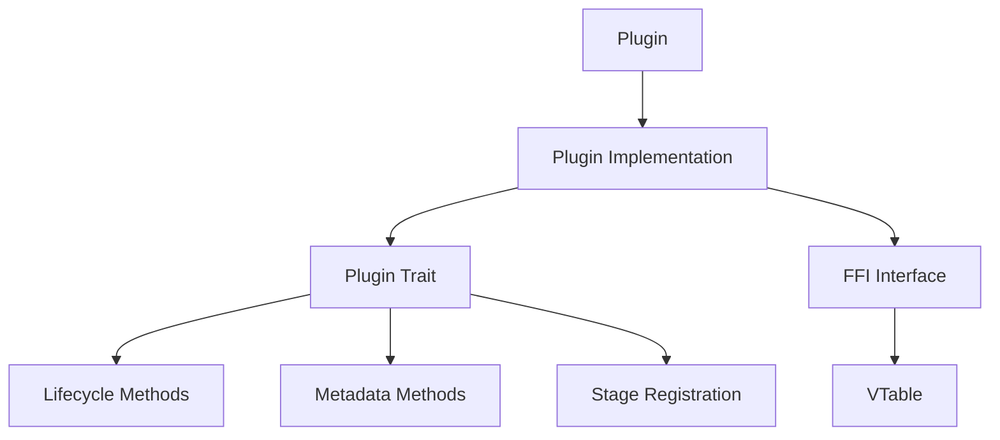

# Plugin System Developer Guide

This guide provides comprehensive information for developers who want to create plugins for the Gini application. It's based on the actual implementation patterns found in the example and core plugins.

## Plugin Architecture Overview

Gini uses a dynamic plugin system that allows extending the application's functionality without modifying its core code. Plugins are loaded at runtime and can interact with the application through well-defined interfaces.



## Core Components

### Plugin Trait

Every plugin must implement the `Plugin` trait, which defines the contract between the plugin and the framework.

```rust
use async_trait::async_trait;
use gini_core::plugin_system::{
    Plugin, PluginDependency, PluginPriority, version::VersionRange,
};
use gini_core::plugin_system::error::PluginSystemError;
use gini_core::stage_manager::{StageContext, requirement::StageRequirement};
use gini_core::stage_manager::registry::StageRegistry;
use gini_core::kernel::bootstrap::Application;

#[async_trait]
impl Plugin for MyPlugin {
    // Identity methods
    fn name(&self) -> &'static str;
    fn version(&self) -> &str;
    fn is_core(&self) -> bool;
    fn priority(&self) -> PluginPriority;
    
    // Compatibility and relationships
    fn compatible_api_versions(&self) -> Vec<VersionRange>;
    fn dependencies(&self) -> Vec<PluginDependency>;
    fn conflicts_with(&self) -> Vec<String>;
    fn incompatible_with(&self) -> Vec<PluginDependency>;
    fn required_stages(&self) -> Vec<StageRequirement>;
    
    // Lifecycle methods
    fn init(&self, app: &mut Application) -> Result<(), PluginSystemError>;
    async fn preflight_check(&self, context: &StageContext) -> Result<(), PluginSystemError>;
    fn shutdown(&self) -> Result<(), PluginSystemError>;
    
    // Stage management
    fn register_stages(&self, registry: &mut StageRegistry) -> Result<(), PluginSystemError>;
}
```

### FFI Interface

For the plugin to be loaded dynamically, it must also expose a C-compatible interface by implementing an entry point function that returns a VTable of function pointers.

```rust
use gini_core::plugin_system::traits::{
    FfiResult, FfiSlice, FfiVersionRange, FfiPluginDependency,
    FfiStageRequirement, PluginVTable, FfiPluginPriority,
};
use std::os::raw::{c_char, c_void};
use std::ffi::CString;
use std::panic;

#[no_mangle]
pub extern "C" fn _plugin_init() -> *mut PluginVTable {
    // Use catch_unwind to prevent panics from crossing FFI boundaries
    let result = panic::catch_unwind(|| {
        // Create the plugin instance
        let plugin_instance = Box::new(MyPlugin { _marker: 0 });
        
        // Create the VTable
        let vtable = PluginVTable {
            instance: Box::into_raw(plugin_instance) as *mut c_void,
            destroy: ffi_destroy,
            name: ffi_get_name,
            free_name: ffi_free_name,
            // ... Other function pointers ...
        };
        
        // Return raw pointer to the VTable
        Box::into_raw(Box::new(vtable))
    });
    
    match result {
        Ok(ptr) => ptr,
        Err(_) => std::ptr::null_mut(),
    }
}
```

## Creating a Plugin

### Step 1: Create a New Rust Library Project

```bash
cargo new --lib my-gini-plugin
```

### Step 2: Configure Cargo.toml

```toml
[package]
name = "my-gini-plugin"
version = "0.1.0"
edition = "2021"

[lib]
crate-type = ["cdylib"]

[dependencies]
gini-core = { path = "../path/to/gini-core", version = "0.1.0" }
async-trait = "0.1.64"
log = "0.4"
serde = { version = "1.0", features = ["derive"] }
```

### Step 3: Implement the Plugin Struct

```rust
// Define a key for the context data (if needed)
const MY_PLUGIN_CONTEXT_KEY: &str = "my_plugin_value";

struct MyPlugin {
    // Add a field to ensure it's not a Zero-Sized Type (ZST)
    // This prevents Box::into_raw from potentially returning a sentinel
    // which could lead to undefined behavior.
    _marker: u8,
}
```

### Step 4: Implement the Plugin Trait

```rust
#[async_trait]
impl Plugin for MyPlugin {
    fn name(&self) -> &'static str {
        "my-plugin"
    }

    fn version(&self) -> &str {
        "0.1.0"
    }

    fn is_core(&self) -> bool {
        false // Set to true for core plugins only
    }

    fn priority(&self) -> PluginPriority {
        PluginPriority::ThirdParty(150) // Choose appropriate priority
    }

    fn compatible_api_versions(&self) -> Vec<VersionRange> {
        vec![VersionRange::from_constraint("~0.1.0").expect("Invalid version constraint")]
    }

    fn dependencies(&self) -> Vec<PluginDependency> {
        vec![
            // Specify dependencies if needed
            // PluginDependency::new("other-plugin", ">=1.0.0", true),
        ]
    }

    fn conflicts_with(&self) -> Vec<String> {
        vec![] // List conflicting plugins if any
    }

    fn incompatible_with(&self) -> Vec<PluginDependency> {
        vec![] // List incompatible plugins if any
    }

    fn required_stages(&self) -> Vec<StageRequirement> {
        vec![] // Specify required stages if any
    }

    fn init(&self, _app: &mut Application) -> Result<(), PluginSystemError> {
        println!("MyPlugin initialized.");
        // Initialize resources, register with services
        Ok(())
    }

    async fn preflight_check(&self, context: &StageContext) -> Result<(), PluginSystemError> {
        // Verify prerequisites before full activation
        // Check context for required data
        
        // Example check:
        let check_value = context.get_data::<String>(MY_PLUGIN_CONTEXT_KEY);
        match check_value {
            Some(val) if val == "valid" => Ok(()),
            _ => Err(PluginSystemError::PreflightCheckFailed {
                plugin_id: self.name().to_string(),
                message: "Required context data missing".to_string()
            })
        }
    }

    fn register_stages(&self, registry: &mut StageRegistry) -> Result<(), PluginSystemError> {
        // Register plugin-provided stages if any
        // registry.register_stage(Box::new(MyCustomStage))?;
        Ok(())
    }

    fn shutdown(&self) -> Result<(), PluginSystemError> {
        println!("MyPlugin shutting down.");
        // Release resources, clean up
        Ok(())
    }
}
```

### Step 5: Implement the FFI Interface

```rust
// Define FFI function to destroy plugin instance
extern "C" fn ffi_destroy(instance: *mut c_void) {
    if !instance.is_null() {
        // Reconstruct the box and let it drop, freeing the memory
        let _ = unsafe { Box::from_raw(instance as *mut MyPlugin) };
    }
}

// Get plugin name for FFI
extern "C" fn ffi_get_name(instance: *const c_void) -> *const c_char {
    let plugin = unsafe { &*(instance as *const MyPlugin) };
    match CString::new(plugin.name()) {
        Ok(s) => s.into_raw(), // Transfer ownership to host
        Err(_) => std::ptr::null(),
    }
}

// Free plugin name string for FFI
extern "C" fn ffi_free_name(name_ptr: *mut c_char) {
    if !name_ptr.is_null() {
        unsafe { let _ = CString::from_raw(name_ptr); }
    }
}

// Implement other required FFI functions for version, compatibility, etc.
// See the example compatibility check plugin for full implementation details

// Export the plugin init function
#[no_mangle]
pub extern "C" fn _plugin_init() -> *mut PluginVTable {
    // Implementation as shown earlier
}
```

### Step 6 (Optional): Implement Custom Stages

If your plugin provides functionality through the stage system, implement the `Stage` trait:

```rust
use gini_core::stage_manager::Stage;

struct MyCustomStage;

#[async_trait]
impl Stage for MyCustomStage {
    fn id(&self) -> &str {
        "my_plugin:custom_stage"
    }

    fn name(&self) -> &str {
        "My Custom Stage"
    }

    fn description(&self) -> &str {
        "Performs custom functionality for my plugin."
    }
 
    async fn execute(&self, context: &mut StageContext) -> std::result::Result<(), Box<dyn std::error::Error + Send + Sync + 'static>> {
        // Stage implementation logic
        println!("Executing custom stage");
        
        // Store data in context
        context.set_data("my_result", "success");
        
        Ok(())
    }
}
```

## Plugin Lifecycle

Plugins go through several stages during their lifecycle:

1. **Discovery**: The application finds plugin libraries in designated directories
2. **Loading**: The plugin library is loaded and `_plugin_init()` is called to obtain the VTable
3. **Validation**: Plugin metadata is validated for compatibility
4. **Dependency Resolution**: Dependencies are checked and loaded if needed
5. **Registration**: Plugin registers with the framework and its stages are registered
6. **Initialization**: `init()` is called to set up the plugin
7. **Preflight Check**: `preflight_check()` verifies the plugin can operate correctly
8. **Runtime**: Plugin operates as part of the application
9. **Shutdown**: `shutdown()` is called during application exit to clean up resources

## Integration with Framework Components

### Stage Context

Plugins can access and modify shared data through the stage context:

```rust
// Reading data
let value = context.get_data::<MyType>("key");

// Writing data
context.set_data("key", MyValue { data: 42 });
```

### Application Access

During initialization, plugins get access to the application instance:

```rust
fn init(&self, app: &mut Application) -> Result<(), PluginSystemError> {
    // Access application components
    let event_mgr = app.get_component::<EventManager>()?;
    let storage = app.get_component::<StorageManager>()?;
    
    // Register with services
    event_mgr.subscribe("app_event", Box::new(|event| {
        println!("Received event: {:?}", event);
    }))?;
    
    Ok(())
}
```

### Stage Registration

Plugins can register custom stages with the stage system:

```rust
fn register_stages(&self, registry: &mut StageRegistry) -> Result<(), PluginSystemError> {
    // Create and register custom stages
    let my_stage = Box::new(MyCustomStage);
    registry.register_stage(my_stage)?;
    
    Ok(())
}
```

## Memory Safety in FFI

The plugin system requires careful memory management across language boundaries:

1. **Non-Zero Sized Types**: Ensure plugin structs have at least one field to prevent UB with raw pointers
2. **Panic Catching**: Use `catch_unwind` to prevent panics from crossing FFI boundaries
3. **Pointer Validation**: Always check pointers for null before dereferencing
4. **Resource Management**: Properly handle ownership transfers for strings and other resources
5. **Memory Cleanup**: Implement proper cleanup functions for allocated resources

## Best Practices

1. **Error Handling**: Use `PluginSystemError` for error reporting and provide descriptive messages
2. **Version Compatibility**: Specify compatible API versions explicitly
3. **Priority Selection**: Choose appropriate priority levels based on plugin functionality
4. **Context Usage**: Use the stage context for sharing data rather than global variables
5. **Resource Cleanup**: Ensure all resources are properly released in the shutdown method
6. **FFI Safety**: Follow Rust FFI best practices for memory safety
7. **Stage Naming**: Use plugin-specific prefixes for stage IDs to prevent conflicts

## Testing Your Plugin

The Gini framework enables testing plugin functionality:

```rust
#[cfg(test)]
mod tests {
    use super::*;
    use gini_core::stage_manager::StageContext;
    
    #[tokio::test]
    async fn test_preflight_check() {
        let plugin = MyPlugin { _marker: 0 };
        let mut context = StageContext::new();
        
        // Test failure case
        let result = plugin.preflight_check(&context).await;
        assert!(result.is_err());
        
        // Test success case
        context.set_data(MY_PLUGIN_CONTEXT_KEY, "valid".to_string());
        let result = plugin.preflight_check(&context).await;
        assert!(result.is_ok());
    }
}
```

## Real-World Examples

For complete implementation examples, refer to the existing plugins:

1. **Core Environment Check Plugin**: System information gathering with multiple stages
2. **Core Logging Plugin**: Tracing setup and log handling
3. **Compatibility Check Plugin**: Reference implementation with detailed FFI interface

These examples demonstrate different plugin patterns, from simple functionality to complex multi-stage operations with custom data structures.

## Distribution

Package your plugin as a shared library (.so on Linux, .dll on Windows, .dylib on macOS). Users can install it by placing it in the application's plugin directory, typically:

- Linux: `~/.local/share/gini/plugins/`
- macOS: `~/Library/Application Support/gini/plugins/`
- Windows: `%APPDATA%\gini\plugins\`

## Debugging Plugins

1. **Logging**: Use the `log` or `tracing` crates for proper diagnostic output
2. **Environment Variables**: Set `RUST_LOG=debug` to see detailed plugin loading logs
3. **Test Mode**: Use the application's test mode for isolated plugin testing
4. **Assertions**: Add debug assertions for important invariants