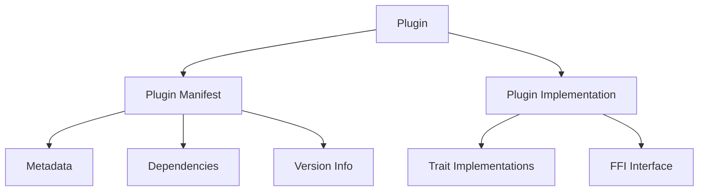

# Plugin System Developer Guide

This guide provides comprehensive information for developers who want to create plugins for the Gini application.

## Plugin Architecture Overview

Gini uses a dynamic plugin system that allows extending the application's functionality without modifying its core code. Plugins are loaded at runtime and can interact with the application through well-defined interfaces.



## Plugin Components

### Plugin Manifest

Every plugin must include a manifest that declares:

1. **Plugin Identifier**: A unique name for the plugin
2. **Version**: Following semantic versioning principles
3. **Dependencies**: Other plugins this plugin depends on
4. **Compatibility Information**: Core application versions compatible with this plugin
5. **Entry Point**: The function to call when initializing the plugin

Example manifest structure:
```rust
#[derive(Serialize, Deserialize, Debug, Clone)]
pub struct PluginManifest {
    pub name: String,
    pub version: Version,
    pub dependencies: Vec<Dependency>,
    pub compatibility: CompatibilityInfo,
    // Additional metadata
}
```

### Plugin Traits

Plugins must implement the core `Plugin` trait and optionally other interface traits:

```rust
pub trait Plugin {
    fn name(&self) -> &str;
    fn version(&self) -> &Version;
    fn initialize(&mut self) -> Result<(), PluginError>;
    fn shutdown(&mut self) -> Result<(), PluginError>;
    // Additional lifecycle methods
}

// Optional traits for specific functionality
pub trait EventListener { /* ... */ }
pub trait ConfigProvider { /* ... */ }
pub trait StorageHandler { /* ... */ }
```

## Creating a Plugin

### Step 1: Create a New Rust Library Project

```bash
cargo new --lib my-gini-plugin
```

### Step 2: Configure Cargo.toml

```toml
[package]
name = "my-gini-plugin"
version = "0.1.0"
edition = "2021"

[lib]
crate-type = ["cdylib"]

[dependencies]
gini-plugin-api = "1.0"  # The plugin API crate
```

### Step 3: Implement the Plugin Trait

```rust
use gini_plugin_api::{Plugin, Version, PluginError, register_plugin};

#[derive(Default)]
pub struct MyPlugin {
    // Plugin state
}

impl Plugin for MyPlugin {
    fn name(&self) -> &str {
        "my-plugin"
    }
    
    fn version(&self) -> &Version {
        &Version::new(0, 1, 0)
    }
    
    fn initialize(&mut self) -> Result<(), PluginError> {
        // Initialization logic
        Ok(())
    }
    
    fn shutdown(&mut self) -> Result<(), PluginError> {
        // Cleanup logic
        Ok(())
    }
}

// Register the plugin with the system
register_plugin!(MyPlugin);
```

### Step 4: Create Plugin Manifest

```rust
use gini_plugin_api::{PluginManifest, Version, Dependency, CompatibilityInfo};

fn create_manifest() -> PluginManifest {
    PluginManifest {
        name: "my-plugin".to_string(),
        version: Version::new(0, 1, 0),
        dependencies: vec![
            Dependency {
                name: "other-plugin".to_string(),
                version_req: ">= 1.0, < 2.0".to_string(),
            },
        ],
        compatibility: CompatibilityInfo {
            core_version_req: ">= 1.0, < 2.0".to_string(),
        },
    }
}
```

## Plugin Lifecycle

Plugins go through several stages during their lifecycle:

1. **Discovery**: The application finds plugin files in designated directories
2. **Loading**: Plugin binary is loaded into memory
3. **Preflight**: Manifest is read and validated
4. **Dependency Resolution**: Plugin dependencies are checked and loaded if needed
5. **Initialization**: Plugin's initialize method is called
6. **Runtime**: Plugin operates as part of the application
7. **Shutdown**: Plugin's shutdown method is called during application exit

## Interacting with Core Systems

### Event System

Plugins can publish and subscribe to events:

```rust
impl EventListener for MyPlugin {
    fn on_event(&self, event: &Event) -> Result<(), EventError> {
        match event.event_type() {
            EventType::ApplicationStarted => {
                // Handle application start
            },
            EventType::ConfigChanged => {
                // Handle config change
            },
            _ => {} // Ignore other events
        }
        Ok(())
    }
}
```

### Configuration System

Plugins can access and modify configuration:

```rust
fn get_config(&self, config_manager: &ConfigManager) -> Result<(), PluginError> {
    let plugin_config = config_manager.get_plugin_config(self.name())?;
    
    // Access config values
    let value = plugin_config.get("some_key").unwrap_or_default();
    
    Ok(())
}
```

### Storage System

Plugins can use the storage system for data persistence:

```rust
fn save_data(&self, storage_manager: &StorageManager) -> Result<(), PluginError> {
    let storage = storage_manager.get_plugin_storage(self.name())?;
    
    storage.set("key", "value")?;
    
    Ok(())
}
```

## Error Handling

Plugins should use the error types defined by the core application:

```rust
fn risky_operation(&self) -> Result<(), PluginError> {
    // Operation that might fail
    if something_went_wrong {
        return Err(PluginError::OperationFailed("Detailed error message".to_string()));
    }
    
    Ok(())
}
```

## Best Practices

1. **Graceful Failures**: Handle errors gracefully and avoid panicking
2. **Resource Management**: Clean up resources in the shutdown method
3. **Dependency Declaration**: Explicitly declare all plugin dependencies
4. **Version Compatibility**: Specify compatible core application versions
5. **Event-Driven Design**: Use the event system rather than direct function calls
6. **Configuration Defaults**: Provide sensible defaults for configuration
7. **Documentation**: Document how your plugin interacts with the system

## Testing Your Plugin

The Gini framework provides utilities for testing plugins:

```rust
#[cfg(test)]
mod tests {
    use gini_test_utils::{PluginTestHarness, TestEnvironment};
    
    #[test]
    fn test_plugin_initialization() {
        let mut harness = PluginTestHarness::new();
        let plugin = harness.load_plugin("path/to/plugin.so").unwrap();
        
        assert!(plugin.initialize().is_ok());
    }
}
```

## Debugging Plugins

1. Use the `GINI_LOG_LEVEL` environment variable to control logging verbosity
2. Plugin loading issues are logged to the application log
3. Run the application with `--debug-plugins` flag for additional diagnostics

## Distribution

Package your plugin as a shared library (.so on Linux, .dll on Windows, .dylib on macOS) along with a manifest file. Users can install it by placing it in the application's plugin directory.