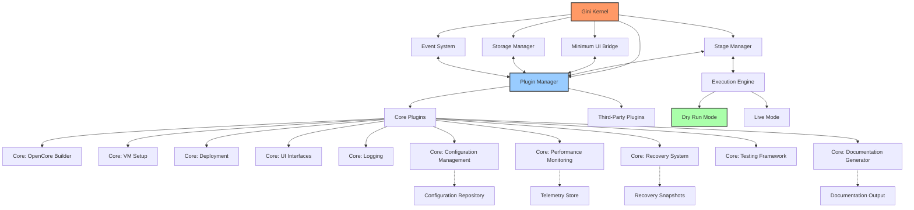
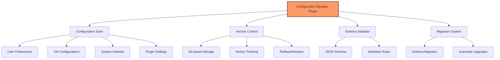
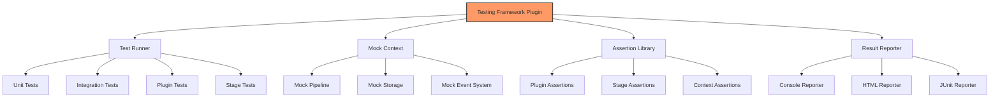
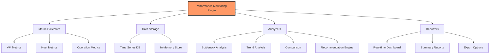
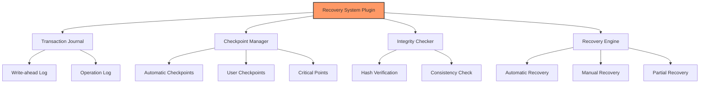
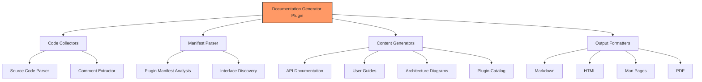
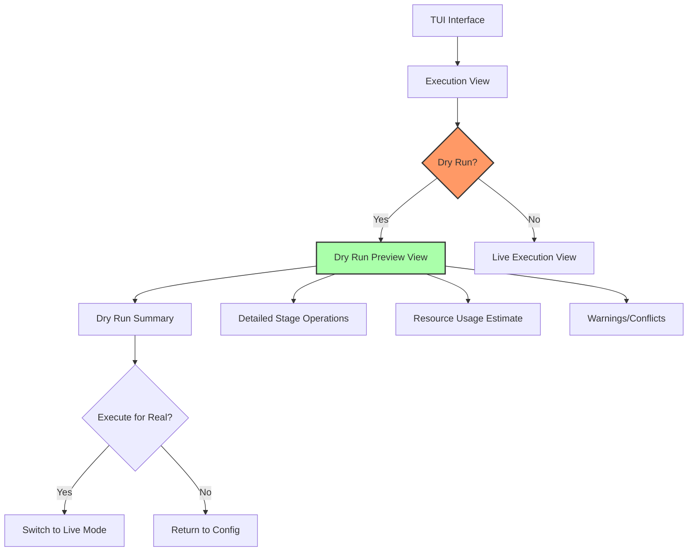
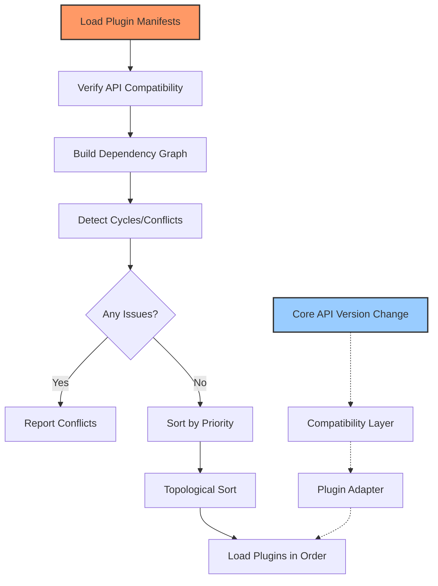

# Gini: QEMU/KVM Deployment System Architecture

**Author:** kunihir0  
**Last Updated:** 2025-04-27

## Introduction

Gini is a modular system for rapidly deploying macOS virtual machines using QEMU/KVM. This document outlines the architecture and implementation guidelines for the project.

The system assumes the user already has:

* A functional Linux setup
* VFIO configured (optional)
* LVM for VM main storage
* QEMU/KVM properly configured

## Core Architecture Design: Everything is a Plugin



## Project Structure

```
gini/                            # Project Root
├── Cargo.toml                   # Workspace definition
├── Cargo.lock
├── .gitignore
├── CONTRIBUTING.md
├── crates/                      # Workspace members
│   ├── gini-core/               # Core library crate
│   │   ├── Cargo.toml
│   │   └── src/
│   │       ├── lib.rs           # Library root
│   │       ├── event/           # Event system (async)
│   │       │   ├── mod.rs
│   │       │   ├── dispatcher.rs # Async event dispatcher (Tokio)
│   │       │   ├── manager.rs    # Event manager component
│   │       │   └── types.rs      # Event types
│   │       ├── kernel/          # Core application kernel
│   │       │   ├── mod.rs
│   │       │   ├── bootstrap.rs  # Application setup and lifecycle
│   │       │   ├── component.rs  # Kernel component trait and registry
│   │       │   ├── constants.rs  # Kernel constants
│   │       │   ├── error.rs      # Error handling
│   │       │   └── tests/        # Kernel tests
│   │       │       ├── mod.rs
│   │       │       └── bootstrap_tests.rs
│   │       ├── plugin_system/   # Plugin infrastructure
│   │       │   ├── mod.rs
│   │       │   ├── registry.rs   # Plugin registry
│   │       │   ├── loader.rs     # Plugin loading
│   │       │   ├── traits.rs     # Plugin traits
│   │       │   ├── dependency.rs # Dependency management
│   │       │   ├── version.rs    # Version compatibility
│   │       │   ├── adapter.rs    # Legacy adapters
│   │       │   ├── manifest.rs   # Plugin manifest handling
│   │       │   ├── conflict.rs   # Conflict resolution
│   │       │   ├── manager.rs    # Plugin manager component
│   │       │   └── tests/        # Plugin system tests
│   │       │       ├── mod.rs
│   │       │       ├── loading_tests.rs
│   │       │       └── preflight_tests.rs
│   │       ├── stage_manager/   # Stage management system
│   │       │   ├── mod.rs
│   │       │   ├── registry.rs   # Stage registration
│   │       │   ├── pipeline.rs   # Stage execution pipeline
│   │       │   ├── context.rs    # Shared stage context
│   │       │   ├── dry_run.rs    # Dry run functionality
│   │       │   ├── dependency.rs # Stage dependency resolver
│   │       │   ├── core_stages.rs # Core lifecycle stages
│   │       │   ├── requirement.rs # Stage requirements
│   │       │   └── manager.rs    # Stage manager component
│   │       ├── storage/         # Storage management
│   │       │   ├── mod.rs
│   │       │   ├── provider.rs   # Storage provider interface
│   │       │   ├── local.rs      # Local filesystem provider
│   │       │   └── manager.rs    # Storage manager component
│   │       ├── ui_bridge/       # Minimal UI abstraction layer
│   │       │   ├── mod.rs
│   │       │   └── messages.rs   # UI message types
│   │       └── utils/           # Core utilities
│   │           ├── mod.rs
│   │           └── fs.rs         # Basic filesystem functions
│   └── gini/                    # Binary crate
│       ├── Cargo.toml
│       └── src/
│           └── main.rs          # Application entry point (async with Tokio)
├── docs/
│   ├── readme.md                # This document
│   ├── implementation_progress.md # Progress tracking
│   ├── refactoring_plan.md      # Refactoring details
│   ├── kernel/
│   │   └── design.md            # Kernel architecture design
│   ├── plugin_system/
│   │   └── dependencies.md      # Plugin dependency system design
│   ├── stage_manager/
│   │   └── plugin_lifecycle_stages.md # Plugin lifecycle stages design
│   └── ui/
│       └── ui-styles.md         # UI styling guidelines
├── plugins/                     # Plugin directory
│   └── examples/                # Example plugins
│       └── compat_check/        # Compatibility check plugin example
│           ├── Cargo.toml
│           └── src/
│               ├── plugin.rs    # Plugin implementation
│               └── tests.rs     # Plugin tests
└── tests/                       # Integration tests (future)
```

## Everything is a Plugin Architecture

### Core Kernel
The Gini kernel provides the core application lifecycle and component management. It has been refactored to use:

* **Component-Based Architecture**: Key subsystems (Events, Plugins, Stages, Storage) are implemented as independent `KernelComponent` traits.
* **Dependency Injection**: Components are managed via a central `DependencyRegistry`, promoting loose coupling and testability.
* **Asynchronous Operations**: The kernel leverages the `Tokio` runtime for non-blocking I/O and concurrent task execution throughout its subsystems.
* **Interface-Driven Design**: Components interact through defined traits (e.g., `EventManager`, `PluginManager`).

The kernel is responsible for:

* Bootstrapping the application and initializing components in the correct order.
* Providing access to shared components via the dependency registry.
* Managing the overall application lifecycle (startup, shutdown).
* Coordinating component interactions through events or direct calls where necessary.
* Managing system storage access via the Storage Manager component. User-specific data and configurations are stored within the `./user/` directory in the project root.

For a detailed explanation of the kernel's design principles and component interactions, see the [Kernel Architecture Design Document](kernel/design.md).

All actual high-level functionality (like building OpenCore or setting up VMs) is implemented within plugins that utilize the kernel's components and services.

### Core Plugins vs. Third-Party Plugins

#### Core Plugins
* Shipped with the application
* Provide essential functionality
* Always loaded by default
* Have special versioning guarantees
* Follow stricter review process

#### Third-Party Plugins
* Installed separately by users
* Provide optional functionality
* Loaded on demand
* Can be community-developed
* Can extend or replace core functionality

### Plugin Priorities
Core plugins have higher priority by default, but can be overridden:

```rust
pub enum PluginPriority {
    Kernel(u8),          // 0-10: Reserved for kernel
    CoreCritical(u8),    // 11-50: Critical core functionality
    Core(u8),            // 51-100: Standard core functionality
    ThirdPartyHigh(u8),  // 101-150: High-priority third-party
    ThirdParty(u8),      // 151-200: Standard third-party
    ThirdPartyLow(u8),   // 201-255: Low-priority third-party
}
```

## Implementation Guidelines

### Plugin System

#### API Versioning

```rust
#[derive(Debug, Clone, PartialEq, Eq, PartialOrd, Ord)]
pub struct ApiVersion {
    pub major: u32,
    pub minor: u32,
    pub patch: u32,
}

impl ApiVersion {
    pub fn new(major: u32, minor: u32, patch: u32) -> Self {
        Self { major, minor, patch }
    }
    
    pub fn from_str(version: &str) -> Result<Self, VersionError> {
        // Parse version string like "1.2.3"
    }
    
    pub fn is_compatible_with(&self, other: &ApiVersion) -> bool {
        // Check compatibility based on semver rules
    }
}

pub struct VersionRange {
    pub min: ApiVersion,
    pub max: ApiVersion,
}
```

#### Plugin Interface

```rust
pub trait Plugin {
    fn name(&self) -> &'static str;
    fn version(&self) -> &str;
    fn is_core(&self) -> bool;
    fn priority(&self) -> PluginPriority;
    
    // Compatible API versions
    fn compatible_api_versions(&self) -> Vec<VersionRange>;
    
    // Plugin dependencies
    fn dependencies(&self) -> Vec<PluginDependency>;
    
    // Stage requirements
    fn required_stages(&self) -> Vec<StageRequirement>;
    
    fn init(&self, app: &mut Application) -> Result<(), PluginError>;
    
    // Perform pre-flight checks before initialization
    async fn preflight_check(&self, context: &StageContext) -> Result<(), PluginError>;
    
    fn stages(&self) -> Vec<Box<dyn Stage>>;
    fn shutdown(&self) -> Result<(), PluginError>;
}
```

#### Plugin Manifest
All plugins define their metadata in a manifest file:

```toml
[plugin]
name = "opencore-builder"
version = "1.2.0"
author = "Gini Team"
description = "Core plugin for building OpenCore images"
core = true
priority = "core:80"  # Core plugin with priority 80

[compatibility]
kernel_api = "^1.0.0"

[dependencies]
storage-manager = ">=1.0.0"
logging = "^1.0.0"

[stage_requirements]
provides = ["opencore.gather", "opencore.edit", "opencore.assemble", "opencore.branding", "opencore.compile"]
```

### Dry Run Mode

#### Overview
Dry run mode allows users to preview the actions that would be performed without actually executing them. This is critical for:

* Understanding the impact of a command
* Validating configurations before committing changes
* Testing plugin behavior without risking system changes
* Debugging plugin implementations
* Educational purposes for users learning the system

#### Implementation

```rust
pub enum ExecutionMode {
    Live,
    DryRun,
}

pub trait DryRunnable {
    fn supports_dry_run(&self) -> bool {
        true  // Most operations should support dry run by default
    }
    
    fn dry_run_description(&self) -> String;
}

// All operations must implement DryRunnable
pub struct FileOperation {
    operation_type: FileOperationType,
    source: PathBuf,
    destination: Option<PathBuf>,
    permissions: Option<u32>,
    content: Option<Vec<u8>>,
}

impl DryRunnable for FileOperation {
    fn dry_run_description(&self) -> String {
        match self.operation_type {
            FileOperationType::Create => format!("Would create file at {}", self.destination.display()),
            FileOperationType::Copy => format!("Would copy {} to {}", self.source.display(), 
                                             self.destination.unwrap_or_default().display()),
            FileOperationType::Delete => format!("Would delete {}", self.source.display()),
            // ...other operations
        }
    }
}
```

#### Dry Run Context
The context tracks operations in dry run mode instead of executing them:

```rust
pub struct DryRunContext {
    planned_operations: Vec<Box<dyn DryRunnable>>,
    stage_operations: HashMap<String, Vec<Box<dyn DryRunnable>>>,
    estimated_disk_usage: u64,
    estimated_duration: Duration,
    potential_conflicts: Vec<String>,
}

impl DryRunContext {
    pub fn record_operation(&mut self, stage_name: &str, operation: Box<dyn DryRunnable>) {
        self.planned_operations.push(operation.clone());
        self.stage_operations
            .entry(stage_name.to_string())
            .or_default()
            .push(operation);
    }
    
    pub fn generate_report(&self) -> DryRunReport {
        // Generate a complete report of all planned operations
    }
}
```

### Configuration Management Plugin

#### Overview
The Configuration Management plugin provides a centralized system for managing user preferences, VM configurations, and system settings with version control capabilities.



#### Implementation

```rust
pub struct ConfigManagerPlugin {
    store: ConfigStore,
    version_control: VersionControl,
    schema: SchemaValidator,
}

impl Plugin for ConfigManagerPlugin {
    fn name(&self) -> &'static str {
        "config-manager"
    }
    
    // Standard plugin implementation...
}

pub struct ConfigStore {
    root_path: PathBuf,
    configs: HashMap<String, Config>,
}

impl ConfigStore {
    pub fn get<T: DeserializeOwned>(&self, path: &str) -> Result<T, ConfigError> {
        // Retrieve and deserialize config
    }
    
    pub fn set<T: Serialize>(&mut self, path: &str, value: &T) -> Result<(), ConfigError> {
        // Serialize and store config
    }
    
    pub fn watch<F>(&self, path: &str, callback: F) -> WatchHandle
    where
        F: Fn(ConfigChangeEvent) + Send + 'static,
    {
        // Set up a watcher for config changes
    }
}

pub struct VersionControl {
    repo: GitRepository,
}

impl VersionControl {
    pub fn commit(&mut self, message: &str) -> Result<String, VcsError> {
        // Commit changes with message
    }
    
    pub fn history(&self, path: &str, limit: usize) -> Vec<ConfigVersion> {
        // Get history of changes to a config
    }
    
    pub fn restore(&mut self, version: &str) -> Result<(), VcsError> {
        // Restore to a specific version
    }
    
    pub fn diff(&self, path: &str, from: &str, to: &str) -> ConfigDiff {
        // Get diff between versions
    }
}
```

#### Configuration Schema Example

```json
{
  "$schema": "http://json-schema.org/draft-07/schema#",
  "type": "object",
  "properties": {
    "version": {
      "type": "string",
      "description": "Schema version for migrations"
    },
    "name": {
      "type": "string",
      "description": "VM name"
    },
    "hardware": {
      "type": "object",
      "properties": {
        "cpu": {
          "type": "object",
          "properties": {
            "cores": {
              "type": "integer",
              "minimum": 1,
              "maximum": 64
            },
            "model": {
              "type": "string",
              "enum": ["penryn", "haswell", "skylake"]
            }
          },
          "required": ["cores", "model"]
        },
        "ram": {
          "type": "object",
          "properties": {
            "size": {
              "type": "integer",
              "minimum": 2048
            },
            "unit": {
              "type": "string",
              "enum": ["MB", "GB"]
            }
          },
          "required": ["size", "unit"]
        }
      },
      "required": ["cpu", "ram"]
    },
    "macos": {
      "type": "object",
      "properties": {
        "version": {
          "type": "string",
          "description": "macOS version"
        },
        "bootArgs": {
          "type": "string",
          "description": "Boot arguments"
        }
      },
      "required": ["version"]
    }
  },
  "required": ["version", "name", "hardware", "macos"]
}
```

### Testing Framework Plugin

#### Overview
The Testing Framework plugin provides facilities for automated testing of other plugins, enabling test-driven development and continuous integration.



#### Implementation

```rust
pub struct TestingFrameworkPlugin {
    test_runner: TestRunner,
    assertions: AssertionLibrary,
    reporter: Box<dyn ResultReporter>,
}

impl Plugin for TestingFrameworkPlugin {
    fn name(&self) -> &'static str {
        "testing-framework"
    }
    
    // Standard plugin implementation...
}

pub struct TestRunner {
    test_suites: HashMap<String, TestSuite>,
}

impl TestRunner {
    pub fn register_suite(&mut self, name: &str, suite: TestSuite) {
        self.test_suites.insert(name.to_string(), suite);
    }
    
    pub fn run_suite(&self, name: &str) -> TestResults {
        // Run the test suite
    }
    
    pub fn run_all(&self) -> HashMap<String, TestResults> {
        // Run all test suites
    }
}

pub struct MockStageContext {
    execution_mode: ExecutionMode,
    storage: MockStorage,
    event_dispatcher: MockEventDispatcher,
    dry_run_context: DryRunContext,
    config: MockConfigStore,
}

impl MockStageContext {
    pub fn new_dry_run() -> Self {
        // Create a mock context for dry run mode
    }
    
    pub fn with_config<T: Serialize>(mut self, path: &str, config: T) -> Self {
        // Add mock config
        self
    }
    
    pub fn with_file(mut self, path: &str, contents: &[u8]) -> Self {
        // Add mock file
        self
    }
    
    pub fn with_event_handler<F>(mut self, event_type: &str, handler: F) -> Self
    where
        F: Fn(&Event) -> EventResult + Send + 'static,
    {
        // Add mock event handler
        self
    }
}

pub struct Assertions {
    pub fn assert_stage_success<S: Stage>(stage: &S, context: &mut MockStageContext) -> StageResult {
        // Assert that a stage executes successfully
    }
    
    pub fn assert_dry_run_contains(context: &MockStageContext, operation_pattern: &str) -> bool {
        // Assert that dry run contains an operation matching the pattern
    }
    
    pub fn assert_plugin_dependencies_resolved(plugin: &dyn Plugin, registry: &PluginRegistry) -> bool {
        // Assert that all plugin dependencies are resolved
    }
    
    pub fn assert_config_valid<T: Serialize>(config: &T, schema: &str) -> bool {
        // Assert that a config is valid against schema
    }
}
```

#### Example Test

```rust
fn test_opencore_edit_stage() {
    // Arrange
    let stage = OpenCoreEditStage::new();
    let mut context = MockStageContext::new_dry_run()
        .with_file("EFI/OC/config.plist", SAMPLE_CONFIG)
        .with_config("macos.bootArgs", "-v keepsyms=1");
        
    // Act
    let result = stage.execute(&mut context);
    
    // Assert
    Assertions::assert_stage_success(&stage, &mut context);
    Assertions::assert_dry_run_contains(&context, "Would modify config.plist");
    Assertions::assert_config_property(&context, "boot_args", "-v keepsyms=1");
}
```

### Performance Monitoring Plugin

#### Overview
The Performance Monitoring plugin collects, analyzes, and reports telemetry data to help users optimize their VM configurations and discover performance bottlenecks.



#### Implementation

```rust
pub struct PerfMonitorPlugin {
    collectors: HashMap<String, Box<dyn MetricCollector>>,
    store: Box<dyn MetricStore>,
    analyzers: Vec<Box<dyn Analyzer>>,
    reporters: Vec<Box<dyn Reporter>>,
}

impl Plugin for PerfMonitorPlugin {
    fn name(&self) -> &'static str {
        "perf-monitor"
    }
    
    // Standard plugin implementation...
}

pub trait MetricCollector: Send + Sync {
    fn name(&self) -> &'static str;
    fn collect(&self) -> Vec<Metric>;
    fn sampling_interval(&self) -> Duration;
}

pub struct VmMetricCollector {
    vm_id: String,
}

impl MetricCollector for VmMetricCollector {
    fn name(&self) -> &'static str {
        "vm-metrics"
    }
    
    fn collect(&self) -> Vec<Metric> {
        // Collect CPU, RAM, disk I/O, network metrics from VM
    }
    
    fn sampling_interval(&self) -> Duration {
        Duration::from_secs(5)
    }
}

pub struct Metric {
    name: String,
    value: MetricValue,
    timestamp: DateTime<Utc>,
    labels: HashMap<String, String>,
}

pub enum MetricValue {
    Counter(u64),
    Gauge(f64),
    Histogram(Vec<f64>),
    Summary { avg: f64, p50: f64, p95: f64, p99: f64 },
}

pub trait Analyzer: Send + Sync {
    fn name(&self) -> &'static str;
    fn analyze(&self, metrics: &[Metric]) -> AnalysisResult;
}

pub struct BottleneckAnalyzer;

impl Analyzer for BottleneckAnalyzer {
    fn name(&self) -> &'static str {
        "bottleneck-analyzer"
    }
    
    fn analyze(&self, metrics: &[Metric]) -> AnalysisResult {
        // Identify resource bottlenecks
    }
}

pub struct RecommendationEngine;

impl Analyzer for RecommendationEngine {
    fn name(&self) -> &'static str {
        "recommendation-engine"
    }
    
    fn analyze(&self, metrics: &[Metric]) -> AnalysisResult {
        // Generate VM optimization recommendations
    }
}
```

#### Real-time Dashboard Example

```rust
pub struct DashboardReporter {
    ui_bridge: Arc<UiBridge>,
}

impl Reporter for DashboardReporter {
    fn name(&self) -> &'static str {
        "dashboard-reporter"
    }
    
    fn report(&self, analysis: &AnalysisResult) {
        let dashboard_update = DashboardUpdate {
            metrics: analysis.metrics.clone(),
            bottlenecks: analysis.bottlenecks.clone(),
            recommendations: analysis.recommendations.clone(),
            timestamp: Utc::now(),
        };
        
        self.ui_bridge.send_message(UiMessage::DashboardUpdate(dashboard_update));
    }
}
```

### Recovery System Plugin

#### Overview
The Recovery System plugin provides mechanisms for creating checkpoints during operations, journaling actions, and restoring system state after failures or interruptions.



#### Implementation

```rust
pub struct RecoverySystemPlugin {
    journal: TransactionJournal,
    checkpoint_manager: CheckpointManager,
    integrity_checker: IntegrityChecker,
    recovery_engine: RecoveryEngine,
}

impl Plugin for RecoverySystemPlugin {
    fn name(&self) -> &'static str {
        "recovery-system"
    }
    
    // Standard plugin implementation...
    
    fn init(&self, app: &mut Application) -> Result<(), PluginError> {
        // Register recovery hooks with the stage manager
        app.stage_manager().register_pre_stage_hook(self.checkpoint_hook());
        app.stage_manager().register_post_stage_hook(self.journal_hook());
        
        // Check for interrupted operations at startup
        self.check_for_recovery(app);
        
        Ok(())
    }
}

pub struct TransactionJournal {
    journal_path: PathBuf,
    current_transaction: Option<Transaction>,
}

impl TransactionJournal {
    pub fn begin_transaction(&mut self, name: &str) -> Result<TransactionId, JournalError> {
        // Begin a new transaction
    }
    
    pub fn record_operation(&mut self, op: RecoverableOperation) -> Result<(), JournalError> {
        // Record an operation in the current transaction
    }
    
    pub fn commit_transaction(&mut self) -> Result<(), JournalError> {
        // Commit the current transaction
    }
    
    pub fn rollback_transaction(&mut self) -> Result<(), JournalError> {
        // Rollback the current transaction
    }
    
    pub fn get_incomplete_transactions(&self) -> Vec<Transaction> {
        // Get all incomplete transactions
    }
}

pub struct CheckpointManager {
    checkpoint_path: PathBuf,
    checkpoints: HashMap<String, Checkpoint>,
}

impl CheckpointManager {
    pub fn create_checkpoint(&mut self, name: &str, context: &StageContext) -> Result<CheckpointId, CheckpointError> {
        // Create a checkpoint of current state
    }
    
    pub fn restore_checkpoint(&self, id: &CheckpointId) -> Result<(), CheckpointError> {
        // Restore system to a checkpoint
    }
    
    pub fn list_checkpoints(&self) -> Vec<CheckpointInfo> {
        // List all available checkpoints
    }
}

pub struct RecoveryEngine {
    transaction_journal: Arc<TransactionJournal>,
    checkpoint_manager: Arc<CheckpointManager>,
}

impl RecoveryEngine {
    pub fn check_for_recovery(&self, app: &Application) -> Option<RecoveryPlan> {
        // Check if recovery is needed
    }
    
    pub fn execute_recovery(&self, plan: &RecoveryPlan) -> Result<RecoveryResult, RecoveryError> {
        // Execute a recovery plan
    }
    
    pub fn generate_recovery_plan(&self, transaction_id: &TransactionId) -> RecoveryPlan {
        // Generate a plan to recover from a failed transaction
    }
}
```

#### Example Recovery Flow

```rust
// During normal operation
fn execute_vm_creation(context: &mut StageContext) -> Result<(), StageError> {
    // Start tracking this operation
    let recovery = context.get_service::<RecoverySystemPlugin>().unwrap();
    let transaction_id = recovery.begin_transaction("vm_creation")?;
    
    // Create a critical checkpoint before making system changes
    let checkpoint_id = recovery.create_checkpoint("pre_vm_creation", context)?;
    
    // Perform VM creation steps with recovery tracking
    recovery.record_operation(RecoverableOperation::FileCreate {
        path: PathBuf::from("/path/to/vm_disk.qcow2"),
        restore_action: RestoreAction::Delete,
    })?;
    
    // Allocate disk space
    create_disk_image("/path/to/vm_disk.qcow2", 50 * 1024 * 1024 * 1024)?;
    
    // Record next operation
    recovery.record_operation(RecoverableOperation::FileCreate {
        path: PathBuf::from("/path/to/vm.xml"),
        restore_action: RestoreAction::Delete,
    })?;
    
    // Create VM definition
    create_vm_definition("/path/to/vm.xml")?;
    
    // Record LVM operation
    recovery.record_operation(RecoverableOperation::LvmCreate {
        vg_name: "vg_vms".to_string(),
        lv_name: "vm_lv".to_string(),
        restore_action: RestoreAction::LvmRemove,
    })?;
    
    // Create LVM volume
    create_lvm_volume("vg_vms", "vm_lv", 100 * 1024 * 1024 * 1024)?;
    
    // Commit the transaction as successful
    recovery.commit_transaction(transaction_id)?;
    
    Ok(())
}

// On startup, check for incomplete operations
fn check_recovery_on_startup(app: &mut Application) {
    let recovery = app.get_service::<RecoverySystemPlugin>().unwrap();
    
    if let Some(recovery_plan) = recovery.check_for_recovery(app) {
        println!("Detected incomplete operation: {}", recovery_plan.transaction_name);
        println!("Would you like to recover? (y/n)");
        
        if get_user_confirmation() {
            match recovery.execute_recovery(&recovery_plan) {
                Ok(result) => println!("Recovery completed: {:?}", result),
                Err(e) => println!("Recovery failed: {}", e),
            }
        }
    }
}
```

### Documentation Generation Plugin

#### Overview
The Documentation Generator plugin extracts documentation from plugin manifests, source code comments, and runtime information to generate comprehensive user and developer documentation.



#### Implementation

```rust
pub struct DocGeneratorPlugin {
    collectors: Vec<Box<dyn DocumentationCollector>>,
    generators: HashMap<String, Box<dyn ContentGenerator>>,
    formatters: HashMap<String, Box<dyn OutputFormatter>>,
}

impl Plugin for DocGeneratorPlugin {
    fn name(&self) -> &'static str {
        "doc-generator"
    }
    
    // Standard plugin implementation...
}

pub trait DocumentationCollector: Send + Sync {
    fn name(&self) -> &'static str;
    fn collect(&self, app: &Application) -> Collection;
}

pub struct ManifestCollector;

impl DocumentationCollector for ManifestCollector {
    fn name(&self) -> &'static str {
        "manifest-collector"
    }
    
    fn collect(&self, app: &Application) -> Collection {
        // Extract documentation from plugin manifests
        let mut collection = Collection::new("Plugin Manifests");
        
        for plugin in app.plugin_registry().plugins() {
            if let Some(manifest) = app.plugin_registry().get_manifest(plugin.name()) {
                collection.add_item(DocumentationItem::new()
                    .with_name(plugin.name())
                    .with_description(manifest.description.clone())
                    .with_version(manifest.version.clone())
                    .with_author(manifest.author.clone())
                    .with_metadata("core", manifest.core.to_string())
                    .with_metadata("priority", manifest.priority.to_string())
                );
            }
        }
        
        collection
    }
}

pub trait ContentGenerator: Send + Sync {
    fn name(&self) -> &'static str;
    fn generate(&self, collections: &[Collection]) -> Document;
}

pub struct ApiDocGenerator;

impl ContentGenerator for ApiDocGenerator {
    fn name(&self) -> &'static str {
        "api-doc-generator"
    }
    
    fn generate(&self, collections: &[Collection]) -> Document {
        // Generate API documentation
    }
}

pub trait OutputFormatter: Send + Sync {
    fn name(&self) -> &'static str;
    fn format(&self, document: &Document) -> Result<Vec<u8>, FormatError>;
    fn extension(&self) -> &'static str;
}

pub struct MarkdownFormatter;

impl OutputFormatter for MarkdownFormatter {
    fn name(&self) -> &'static str {
        "markdown-formatter"
    }
    
    fn format(&self, document: &Document) -> Result<Vec<u8>, FormatError> {
        // Convert document to Markdown format
    }
    
    fn extension(&self) -> &'static str {
        "md"
    }
}

pub struct HtmlFormatter {
    template: String,
}

impl OutputFormatter for HtmlFormatter {
    fn name(&self) -> &'static str {
        "html-formatter"
    }
    
    fn format(&self, document: &Document) -> Result<Vec<u8>, FormatError> {
        // Convert document to HTML format using template
    }
    
    fn extension(&self) -> &'static str {
        "html"
    }
}
```

#### Diagram Generator Example

```rust
pub struct DiagramGenerator;

impl ContentGenerator for DiagramGenerator {
    fn name(&self) -> &'static str {
        "diagram-generator"
    }
    
    fn generate(&self, collections: &[Collection]) -> Document {
        let mut document = Document::new("Gini Architecture Diagrams");
        
        // Generate plugin dependency diagram
        let mut mermaid = String::from("graph TD\n");
        
        for plugin_item in collections.iter().flat_map(|c| c.items()) {
            if let Some(deps) = plugin_item.metadata.get("dependencies") {
                let plugin_name = plugin_item.name.replace("-", "_");
                for dep in deps.split(',') {
                    let dep_name = dep.trim().replace("-", "_");
                    mermaid.push_str(&format!("    {} --> {}\n", plugin_name, dep_name));
                }
            }
        }
        
        document.add_section(Section::new("Plugin Dependencies")
            .with_content(mermaid)
            .with_metadata("type", "mermaid"));
        
        // Generate stage pipeline diagram
        // ...
        
        document
    }
}
```

#### Usage Example

```rust
fn generate_documentation(app: &Application, output_dir: &Path) -> Result<(), DocError> {
    let doc_plugin = app.get_service::<DocGeneratorPlugin>().unwrap();
    
    // Generate all documentation
    doc_plugin.generate_all(output_dir)?;
    
    // Generate specific documentation
    doc_plugin.generate_api_docs(output_dir.join("api"))?;
    doc_plugin.generate_user_guide(output_dir.join("user_guide"))?;
    doc_plugin.generate_plugin_catalog(output_dir.join("plugins"))?;
    
    println!("Documentation generated at: {}", output_dir.display());
    Ok(())
}
```

## Stage System Design

```mermaid
graph TB
    subgraph "Stage System Flow"
        A[Stage Manager] --> B{Load Stages from Plugins}
        B --> C[Resolve Dependencies]
        C --> D[Build Pipeline]
        D --> E1{Execution Mode?}
        E1 -- Live --> E2[Execute Pipeline]
        E1 -- Dry Run --> E3[Simulate Pipeline]
        
        E2 --> F{Execute Stage}
        F -- Success --> G[Next Stage]
        F -- Failure --> H[Error Handler]
        G --> I{More Stages?}
        I -- Yes --> F
        I -- No --> J1[Complete]
        H --> K{Recoverable?}
        K -- Yes --> L[Recover & Retry]
        K -- No --> M1[Abort Pipeline]
        L --> F
        
        E3 --> F2{Simulate Stage}
        F2 -- Success --> G2[Next Stage]
        F2 -- Failure --> H2[Error Handler]
        G2 --> I2{More Stages?}
        I2 -- Yes --> F2
        I2 -- No --> J2[Generate Report]
        H2 --> M2[Add to Report]
        M2 --> I2
        
        J2 --> R[Display Dry Run Report]
    end
    
    subgraph "Extended OpenCore Build Pipeline"
        OC1[Gather Files] --> OC2[Edit Configs]
        OC2 --> OC3[Custom Kexts]
        OC3 --> OC4[Assemble Structure]
        OC4 --> OC5[Apply Branding]
        OC5 --> OC6[Compile to QCOW2]
        OC6 --> OC7[Performance Profile]
        OC7 --> OC8[Checkpoint]
    end
    
    style A fill:#f96,stroke:#333,stroke-width:2px
    style E1 fill:#f96,stroke:#333,stroke-width:2px
    style E3 fill:#afa,stroke:#333,stroke-width:2px
    style R fill:#afa,stroke:#333,stroke-width:2px
    style OC1 fill:#9cf,stroke:#333,stroke-width:2px
    style OC3 fill:#f99,stroke:#333,stroke-width:2px
    style OC7 fill:#9cf,stroke:#333,stroke-width:2px
    style OC8 fill:#9cf,stroke:#333,stroke-width:2px
```



## Dry Run Mode Example

### CLI Command Example

```
$ gini create-vm --name "My macOS VM" --version monterey --cpu-cores 4 --ram 8G --dry-run

Dry Run Results:
================

Stage: vm_setup.cpu
- Would configure CPU with 4 cores using host-passthrough
- Would set CPU model to Penryn
- Would enable SSE4.2, AVX, and XSAVE CPU flags

Stage: vm_setup.ram
- Would allocate 8G RAM
- Would enable memory ballooning

Stage: opencore.gather
- Would download OpenCore v0.8.5 files to ~/.gini/tmp/opencore_0.8.5
- Would download OVMF firmware to ~/.gini/tmp/OVMF_CODE.fd

Stage: opencore.edit
- Would modify config.plist to enable GUI boot menu
- Would set boot arguments to "-v keepsyms=1"

Stage: custom_kexts.add_kexts
- Would add Lilu.kext from ~/custom_kexts
- Would add WhateverGreen.kext from ~/custom_kexts
- Would update config.plist to enable these kexts

Stage: opencore.assemble
- Would create EFI directory structure in ~/.gini/tmp/efi_mount
- Would copy modified config.plist to EFI/OC/config.plist
- Would copy kexts to EFI/OC/Kexts directory

Stage: opencore.branding
- Would customize boot screen with Gini logo
- Would set boot entry name to "My macOS VM"

Stage: opencore.compile
- Would create OpenCore.qcow2 image (~15MB) at ~/.gini/vms/My macOS VM/OpenCore.qcow2

Stage: recovery.prepare
- Would download macOS Monterey BaseSystem.dmg (~630MB)

Stage: deployment.generate_script
- Would create VM launch script at ~/.gini/vms/My macOS VM/start.sh
- Would set executable permissions on script

Stage: deployment.xml
- Would generate libvirt XML definition at ~/.gini/vms/My macOS VM/vm.xml

Stage: recovery_system.checkpoint
- Would create recovery checkpoint "vm_creation_completed"
- Would journal all created files for recovery

Stage: perf_monitor.baseline
- Would establish performance baseline for new VM
- Would configure performance monitoring collectors

Summary:
- Total operations: 35
- Estimated disk usage: 645MB
- Estimated time: 5-10 minutes (depending on download speed)
- No potential conflicts detected

To execute these changes, run the same command without the --dry-run flag.
```

### TUI Dry Run Example



## Plugin Dependency Resolution



## Key Features and Benefits of "Everything is a Plugin"

### Extreme Modularity
* Even core functionality can be replaced
* Plugins are equal citizens with consistent interface
* System can be pared down to minimal set of plugins
* Different plugin combinations for different use cases

### Simplified Development Model
* Consistent development approach for all features
* Same tools and patterns for core and third-party
* Self-contained modules with clear dependencies
* Built-in versioning and compatibility checks

### Progressive Enhancement
* Start with minimal core plugins
* Add only what's needed for specific workflows
* More complex features implemented as plugins
* Easy to disable unwanted functionality

### Resilient Architecture
* Failure in one plugin doesn't break the system
* Hot-swappable components
* Clear isolation boundaries
* Runtime dependency resolution
* Pre-flight checks to prevent initialization of incompatible/unready plugins

### Customization
* Mix and match plugins for custom workflows
* Override core plugins with customized versions
* Replace individual stages within plugins
* Create specialized distributions with selected plugins

### Dry Run Capability
* Preview operations before execution
* Educational tool for understanding system behavior
* Debugging aid for plugin developers
* Safety feature for testing new plugins
* Resource usage estimation

## Implementation Plan

### Phase 1: Kernel Infrastructure (Completed)
* Plugin system architecture
* Dependency resolution
* Minimal stage manager
* Dry run mode framework
* Cargo workspace structure

### Phase 2: Core Plugins (In Progress)
* Convert core functionality to plugins
* Implement plugin priority system
* Basic UI plugin
* Dry run reporting

### Phase 3: Core Enhancement Plugins (Planned)
* Configuration management system
* Recovery system
* Performance monitoring
* Testing framework

### Phase 4: Plugin Marketplace and Documentation (Planned)
* Plugin discovery mechanism
* Plugin installation/management
* Plugin repository structure
* Documentation generation

### Phase 5: Advanced Plugins and Polish (Planned)
* Create specialized plugins
* Implement adapters for API changes
* Build third-party plugin examples
* Performance optimization
* Dry run visualization improvements