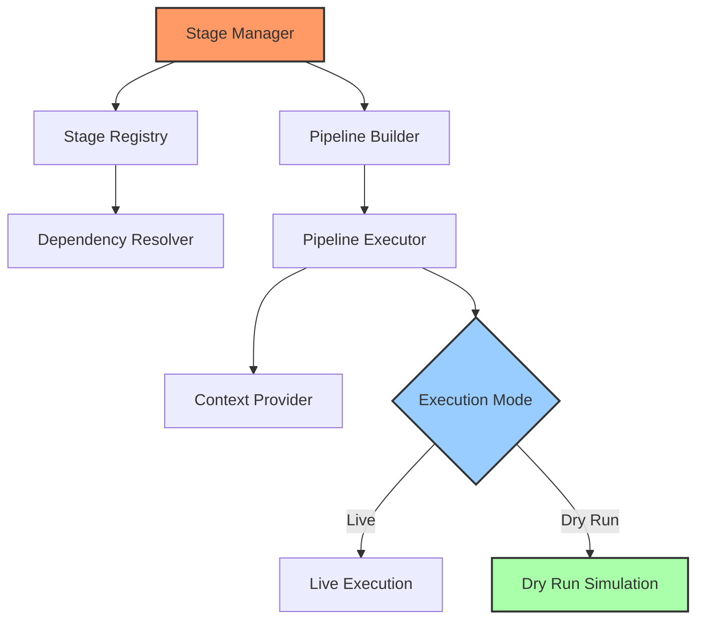

# Stage Manager

## Overview

The Stage Manager orchestrates the execution of stages in a pipeline, ensuring they run in the correct order based on dependencies. It is a critical component for coordinating the execution flow of the application and plugin functions.

## Architecture



## Core Components

### Stage Interface

Stages are the fundamental units of work in the system:

```rust
#[async_trait]
pub trait Stage: Send + Sync {
    /// Get the name of the stage
    fn name(&self) -> &str;
    
    /// Get the stage's dependencies
    fn dependencies(&self) -> Vec<StageDependency>;
    
    /// Execute the stage logic
    async fn execute(&self, context: &mut StageContext) -> StageResult;
    
    /// Determine if this stage can run in dry run mode
    fn supports_dry_run(&self) -> bool {
        true  // Default to supporting dry run
    }
    
    /// Get a description of what this stage would do in dry run mode
    fn dry_run_description(&self) -> String;
}
```

### Stage Manager

The stage manager is the kernel component that provides access to the stage system:

```rust
pub trait StageManager: KernelComponent {
    /// Register a stage
    fn register_stage(&self, stage: Box<dyn Stage>) -> Result<()>;
    
    /// Get all registered stages
    fn get_stages(&self) -> Vec<&dyn Stage>;
    
    /// Build a pipeline with the given stages
    fn build_pipeline(&self, stages: &[&str]) -> Result<Pipeline>;
    
    /// Execute a pipeline with the given stages
    async fn execute_pipeline(&self, stages: &[&str], context: &mut StageContext) -> Result<()>;
    
    /// Execute a pipeline in dry run mode
    async fn dry_run_pipeline(&self, stages: &[&str]) -> Result<DryRunReport>;
    
    /// Register a pre-stage hook to run before each stage
    fn register_pre_stage_hook(&self, hook: Box<dyn StageHook>) -> HookId;
    
    /// Register a post-stage hook to run after each stage
    fn register_post_stage_hook(&self, hook: Box<dyn StageHook>) -> HookId;
    
    /// Unregister a hook
    fn unregister_hook(&self, id: HookId) -> Result<()>;
}
```

### Stage Registry

The registry tracks all registered stages and manages their dependencies:

```rust
pub struct StageRegistry {
    stages: HashMap<String, Box<dyn Stage>>,
}

impl StageRegistry {
    pub fn register_stage(&mut self, stage: Box<dyn Stage>) -> Result<()> {
        let name = stage.name().to_string();
        self.stages.insert(name, stage);
        Ok(())
    }
    
    pub fn get_stage(&self, name: &str) -> Option<&dyn Stage> {
        self.stages.get(name).map(AsRef::as_ref)
    }
    
    pub fn resolve_dependencies(&self, stages: &[&str]) -> Result<Vec<&dyn Stage>> {
        // Resolve dependencies and order stages
    }
}
```

### Pipeline

The pipeline is responsible for executing a sequence of stages in the correct order:

```rust
pub struct Pipeline {
    stages: Vec<Box<dyn Stage>>,
    pre_hooks: Vec<Box<dyn StageHook>>,
    post_hooks: Vec<Box<dyn StageHook>>,
}

impl Pipeline {
    pub async fn execute(&self, context: &mut StageContext) -> Result<()> {
        for stage in &self.stages {
            // Run pre-hooks
            for hook in &self.pre_hooks {
                hook.before_stage(stage.name(), context).await?;
            }
            
            // Execute the stage
            stage.execute(context).await?;
            
            // Run post-hooks
            for hook in &self.post_hooks {
                hook.after_stage(stage.name(), context).await?;
            }
        }
        Ok(())
    }
    
    pub async fn dry_run(&self) -> Result<DryRunReport> {
        // Simulate execution for reporting
    }
}
```

### Stage Context

The context provides shared state and services for stages:

```rust
pub struct StageContext {
    execution_mode: ExecutionMode,
    storage_provider: Arc<dyn StorageProvider>,
    event_dispatcher: Arc<dyn EventDispatcher>,
    dry_run_context: Option<DryRunContext>,
    config: ConfigStore,
    shared_data: HashMap<String, Box<dyn Any + Send + Sync>>,
}
```

## Stage Dependencies

Stages can declare dependencies on other stages:

```rust
pub struct StageDependency {
    pub stage_name: String,
    pub required: bool,
    pub execution_order: DependencyOrder,
}

pub enum DependencyOrder {
    Before,  // This stage must run before the dependent stage
    After,   // This stage must run after the dependent stage
}
```

The dependency resolver uses these declarations to ensure stages run in the correct order.

## Dry Run Mode

The Stage Manager supports a "dry run" mode where stages are simulated rather than executed:

```rust
pub enum ExecutionMode {
    Live,
    DryRun,
}

pub struct DryRunContext {
    planned_operations: Vec<Box<dyn DryRunnable>>,
    stage_operations: HashMap<String, Vec<Box<dyn DryRunnable>>>,
    estimated_disk_usage: u64,
    estimated_duration: Duration,
    potential_conflicts: Vec<String>,
}

pub trait DryRunnable {
    fn supports_dry_run(&self) -> bool {
        true  // Default to supporting dry run
    }
    
    fn dry_run_description(&self) -> String;
}
```

This allows users to preview the effects of a pipeline before actually running it.

## Stage Hooks

Hooks allow for executing code before and after each stage:

```rust
#[async_trait]
pub trait StageHook: Send + Sync {
    async fn before_stage(&self, stage_name: &str, context: &mut StageContext) -> Result<()>;
    async fn after_stage(&self, stage_name: &str, context: &mut StageContext) -> Result<()>;
}
```

Hooks are used for cross-cutting concerns like:
- Logging stage execution
- Creating checkpoints for recovery
- Performance monitoring
- Updating UI progress

## Core Stages

The system defines several core lifecycle stages:

```rust
pub mod core_stages {
    pub const BOOTSTRAP: &str = "core.bootstrap";
    pub const PLUGIN_LOAD: &str = "core.plugin_load";
    pub const PLUGIN_INIT: &str = "core.plugin_init";
    pub const CONFIG_LOAD: &str = "core.config_load";
    pub const UI_INIT: &str = "core.ui_init";
    pub const READY: &str = "core.ready";
    pub const SHUTDOWN: &str = "core.shutdown";
}
```

These stages define the application's core execution flow, which plugins can extend with their own stages.

## Usage Example

Building and executing a pipeline:

```rust
let stage_manager = app.get_component::<StageManager>().unwrap();

// Register stages from a plugin
for stage in plugin.stages() {
    stage_manager.register_stage(stage)?;
}

// Build a pipeline
let pipeline = stage_manager.build_pipeline(&[
    "opencore.gather",
    "opencore.edit",
    "opencore.assemble",
    "opencore.compile",
])?;

// Create a context
let mut context = StageContext::new(ExecutionMode::Live, storage, event_dispatcher);

// Execute the pipeline
stage_manager.execute_pipeline(&[
    "opencore.gather",
    "opencore.edit",
    "opencore.assemble",
    "opencore.compile",
], &mut context).await?;
```

## Dry Run Example

Running a pipeline in dry run mode:

```rust
let report = stage_manager.dry_run_pipeline(&[
    "opencore.gather", 
    "opencore.edit", 
    "opencore.assemble", 
    "opencore.compile"
]).await?;

println!("Dry run summary:");
println!("Total operations: {}", report.total_operations());
println!("Estimated disk usage: {}", report.estimated_disk_usage());
println!("Potential conflicts: {}", report.potential_conflicts().len());