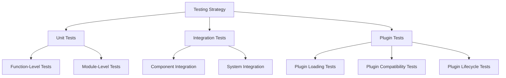

# Testing Strategy Documentation

This document outlines the testing approach and patterns used across the Gini application.

## Testing Architecture

The Gini application follows a comprehensive testing strategy with multiple layers of testing to ensure reliability and correctness.



## Test Categories

### Unit Tests

Unit tests verify the correctness of individual functions, methods, and modules in isolation. These tests are typically located next to the code they test, in a `tests` submodule.

Example unit test structure:

```rust
#[cfg(test)]
mod tests {
    use super::*;
    
    #[test]
    fn test_function_name_with_specific_input() {
        // Test setup
        let input = TestInput::new();
        
        // Call the function under test
        let result = function_under_test(input);
        
        // Assert expected results
        assert_eq!(result, expected_output);
    }
}
```

### Integration Tests

Integration tests verify that different components work together correctly. These are organized in the `tests/integration/` directory and test multiple modules or the entire system.

Example integration test:

```rust
#[cfg(test)]
mod storage_event_integration {
    use gini_core::event::{EventManager, EventType};
    use gini_core::storage::StorageManager;
    
    #[test]
    fn test_config_change_triggers_event() {
        // Initialize components
        let mut event_manager = EventManager::new();
        let mut storage_manager = StorageManager::new();
        
        // Register event listener
        let listener = TestListener::new();
        event_manager.register_listener(Box::new(listener));
        
        // Trigger action that should generate event
        storage_manager.update_config("test", "value");
        
        // Verify event was fired and handled
        assert!(listener.received_event(EventType::ConfigChanged));
    }
}
```

### Plugin Tests

Plugin tests verify plugin loading, dependency resolution, and lifecycle functionality. These tests use special harnesses to simulate the plugin environment.

```rust
#[test]
fn test_plugin_loading_with_dependencies() {
    let test_env = TestEnvironment::new();
    
    // Register test plugins
    test_env.register_plugin("plugin_a", version("1.0.0"));
    test_env.register_plugin("plugin_b", version("1.0.0"))
        .with_dependency("plugin_a", ">= 1.0.0");
    
    // Load plugin B (should automatically load A as dependency)
    let registry = test_env.load_plugin("plugin_b");
    
    // Verify both plugins loaded
    assert!(registry.is_loaded("plugin_a"));
    assert!(registry.is_loaded("plugin_b"));
}
```

## Test Organization

Tests are organized following these patterns:

1. **Unit Tests**: Located in the same file as the code they test, within a `#[cfg(test)] mod tests` block
2. **Module Tests**: Located in a `tests` subdirectory adjacent to the module they test
3. **Integration Tests**: Typically located in a top-level `tests/` directory for a crate (e.g., `crates/your_crate_name/tests/some_integration_test.rs` or `crates/your_crate_name/tests/integration/mod.rs`). This allows testing the public API of the crate as an external user would.
4. **Plugin Tests**: Located in both the plugin system module tests and dedicated directories for test plugins

## Testing Best Practices

### Test Isolation

Tests should be independent and not rely on the state from other tests. Use setup and teardown functions when needed:

```rust
fn setup() -> TestEnvironment {
    let env = TestEnvironment::new();
    // Setup code
    env
}

fn teardown(env: TestEnvironment) {
    // Cleanup code
}

#[test]
fn test_something() {
    let env = setup();
    // Test code
    teardown(env);
}
```

### Mock Objects

Complex dependencies are often mocked to isolate the tested code:

```rust
struct MockStorage {
    values: HashMap<String, String>,
}

impl StorageProvider for MockStorage {
    fn get(&self, key: &str) -> Option<String> {
        self.values.get(key).cloned()
    }
    
    fn set(&mut self, key: &str, value: &str) -> Result<(), StorageError> {
        self.values.insert(key.to_string(), value.to_string());
        Ok(())
    }
}
```

### Error Testing

Test error conditions explicitly:

```rust
#[test]
fn test_error_handling() {
    let result = function_that_should_fail();
    assert!(result.is_err());
    assert_eq!(result.unwrap_err(), ExpectedError::SpecificError);
}
```

### Property-Based Testing

For some components, property-based testing is used to verify invariants hold across a range of inputs:

```rust
#[test]
fn version_comparison_properties() {
    proptest!(|(a in version_strategy(), b in version_strategy(), c in version_strategy())| {
        // Reflexivity
        prop_assert_eq!(a.cmp(&a), Ordering::Equal);
        
        // Transitivity
        if a.cmp(&b) == Ordering::Less && b.cmp(&c) == Ordering::Less {
            prop_assert_eq!(a.cmp(&c), Ordering::Less);
        }
    });
}
```

## Test Coverage

The project aims for high test coverage across all critical paths:

- Core functionality: 90%+ coverage
- Edge cases and error handling: 80%+ coverage
- UI and non-critical paths: 70%+ coverage

Coverage is monitored through:

```bash
cargo tarpaulin --out Xml --output-dir coverage
```

## Continuous Integration

Tests run automatically in CI for each pull request:

1. Fast unit tests run first
2. Integration tests run next
3. Full system tests run last
4. Performance benchmarks run for significant changes

## Test Data Management

Test data is managed through:

1. Fixtures: Standard test data used by multiple tests
2. Factories: Functions that generate test data with sensible defaults
3. Builders: For complex test object construction

Example test data factory:

```rust
fn create_test_plugin(name: &str, version: &str) -> TestPlugin {
    TestPlugin {
        name: name.to_string(),
        version: Version::parse(version).unwrap(),
        dependencies: Vec::new(),
        initialized: false,
    }
}
```

## Debugging Tests

For debugging failing tests:

1. Use `RUST_BACKTRACE=1` for detailed stack traces
2. Use `cargo test -- --nocapture` to see test output
3. Add log statements with `tracing` for detailed diagnostics

## Writing New Tests

When adding new code, follow these steps:

1. Write unit tests for individual functions
2. Write integration tests for module interactions
3. Update existing tests if changing behavior
4. Consider edge cases and error conditions

## Test Refactoring

When refactoring tests, consider:

1. Removing duplication through helper functions
2. Improving test names for clarity
3. Adding comments to explain complex test setups
4. Breaking large tests into smaller, focused tests